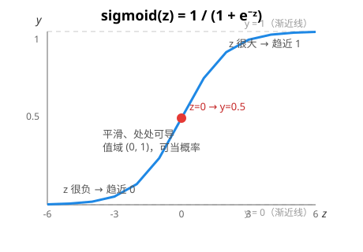
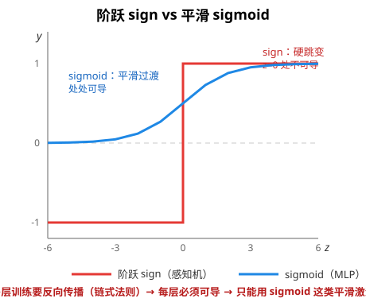

# 激活函数：sigmoid 与阶跃

> 对应代码：`include/mini_mlmath/activation.h`
> 前置阅读：[感知机原理](perceptron.md)、[逻辑门与决策边界](logic_gates.md)

一个神经元（感知机）做两件事：**线性组合**（`z = w·x + b`）→ **激活**（把 z 变成输出）。激活函数就是第二步的那个函数，它决定神经元"怎么反应"。本库的 `activation.h` 提供 sigmoid（标量版 + 矩阵版）。

## 1. 为什么需要激活函数

如果没有激活（直接输出 z），多层网络就废了——**线性变换的复合还是线性变换**：

```
W₂(W₁x + b₁) + b₂ = (W₂W₁)x + (W₂b₁ + b₂)   ← 还是一层能表达的东西
```

叠多少层都等价于一层。**激活函数引入非线性，是"深度"唯一的意义来源**。

## 2. sigmoid：定义与图像

```
sigmoid(z) = 1 / (1 + e⁻ᶻ)
```



三个特征：

- **值域 (0, 1)**：可以当概率看（逻辑回归的输出层就用它）
- **z = 0 时恰好 0.5**：所以 `sigmoid(z) > 0.5 ⟺ z > 0`——和 sign 的决策边界完全一致
- **处处可导、平滑**：这是它比阶跃强的地方（见下）

## 3. 阶跃 vs sigmoid：为什么多层必须换掉 sign



| | 阶跃 sign | sigmoid |
|---|---|---|
| 图像 | 台阶：垂直跳变 | S 形：平滑过渡 |
| 输出 | 只有 ±1 两档 | (0,1) 连续 |
| 导数 | z=0 处不存在，其余恒 0 | 处处可导 |
| 适用 | 单层感知机（不反向传播） | 多层网络（要反向传播） |

**关键链条**（我们之前一步步推过的）：

```
要解决 XOR → 必须加隐藏层（多层）
→ 多层要用梯度下降训练 → 梯度靠反向传播算
→ 反向传播用链式法则 → 每层激活必须可导
→ 阶跃不可导 → 换成 sigmoid / ReLU
```

反向传播里，梯度是"怎么改权重"，链式法则是"怎么算梯度"：

```
∂L/∂w = ∂L/∂ŷ · ∂ŷ/∂z · ∂z/∂w
        └─损失对输出─┘  └激活对分数┘ └分数对权重┘
                       ↑ 这一项只有可导激活才有——阶跃在这里是 0 或不存在
```

所以 `activation.h` 里 sigmoid 的注释写着"MLP 时代改用可导的平滑激活函数"——不是口味，是链条的必然终点。

## 4. 数值稳定性：一个必须记住的坑

直接照定义写 `1/(1+exp(-z))`，当 z 很负（如 -1000）时：

```
exp(-z) = exp(1000) = inf        ← 中间值上溢！
1 / (1 + inf) = 0                ← 结果碰巧对，但中间爆了
```

标准做法是**分段**（数学恒等，但中间值永不溢出）：

```
z >= 0:  sigmoid(z) = 1 / (1 + exp(-z))   ← exp(-z) ∈ (0, 1]，安全
z <  0:  sigmoid(z) = exp(z) / (1 + exp(z)) ← exp(z) ∈ (0, 1)，安全
```

这和 `softmax.h` 的"先减最大值"是同一类陷阱：**指数函数天生会爆，实现里必须防**。PyTorch / numpy 都是这么干的。

## 5. 其他激活函数（预告）

| 函数 | 公式 | 特点 |
|---|---|---|
| tanh | (eᶻ-e⁻ᶻ)/(eᶻ+e⁻ᶻ) | 值域 (-1,1)，零中心 |
| ReLU | max(0, z) | 计算极简、缓解梯度消失，**现代网络默认** |
| softmax | 见 softmax.h | 多分类输出层（归一化成概率分布） |

ReLU 虽然"分段线性"，但 z=0 处有导数（约定取 0 或 1）——它可导，所以能用反向传播。现在的主流选择是 ReLU 而非 sigmoid（sigmoid 两端导数趋近 0，深度网络里梯度会"消失"）。

## 6. 和本库代码的对应

`activation.h` 提供两个重载，编译器按参数自动分派：

```cpp
sigmoid(0.5);                 // 标量版：T -> (0,1)
sigmoid(H);                   // 矩阵版：逐元素激活，返回新矩阵
                              // H 是隐藏层分数，sigmoid(H) 就是整层激活
```

矩阵版就是 MLP 里"每个神经元先加权求和、再过激活"的矩阵化写法：

```cpp
Matrix<T> H = X * W1.transposed();   // 隐藏层线性分数
Matrix<T> A = sigmoid(H);            // 整层激活（逐元素）
Matrix<T> Y = A * W2.transposed();   // 输出层
```

### 为什么 `logic_gate.cpp` 的 and_gate 用 sign 不用 sigmoid？

单层感知机不反向传播、不需要梯度，经典感知机本来就用阶跃函数——**可导性在那里毫无用处**。所以 and_gate 保留 sign（`scores > 0 ? 1 : 0`），sigmoid 留给将来的多层（xor_gate 的隐藏层如果改成可训练版，就要用它）。这正是"工具要用在需要它的地方"。

## 7. 延伸阅读

- [感知机原理](perceptron.md)：阶跃激活的出处，单层模型的完整讲解
- [逻辑门与决策边界](logic_gates.md)：XOR 为什么逼出多层网络
- 逻辑回归：sigmoid + 交叉熵损失 = 可导的线性分类器
- MLP：隐藏层 + sigmoid/ReLU + 反向传播
