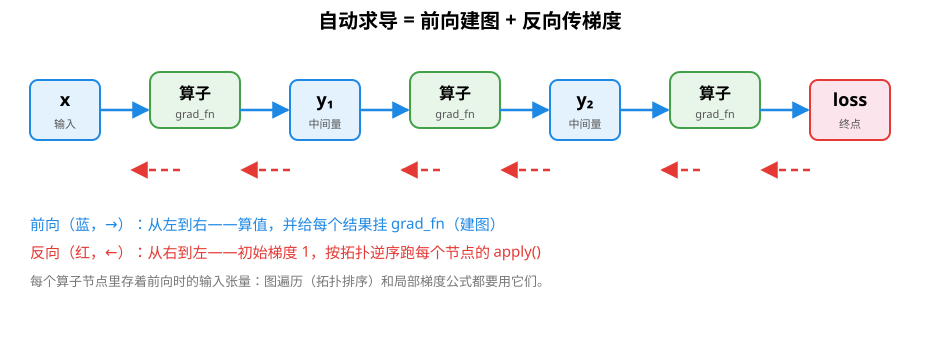
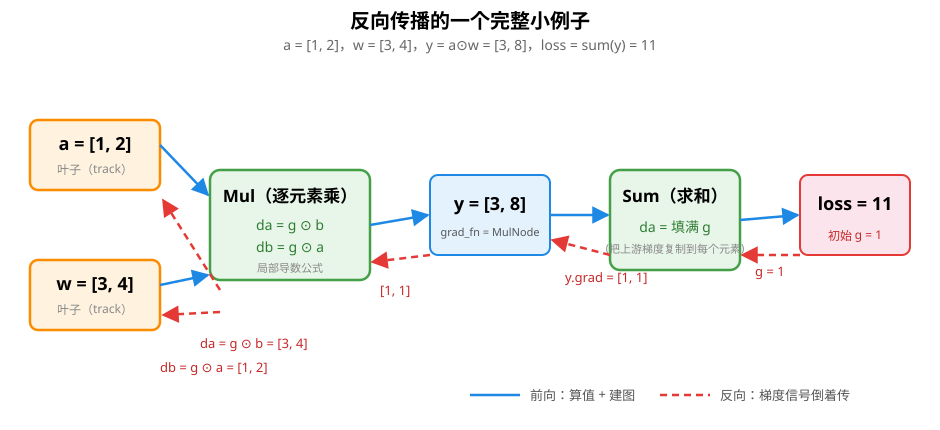
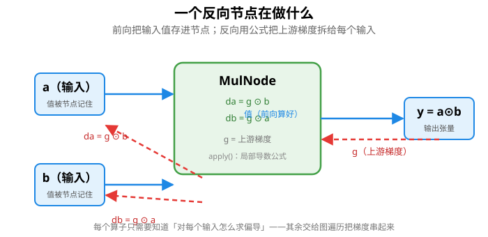
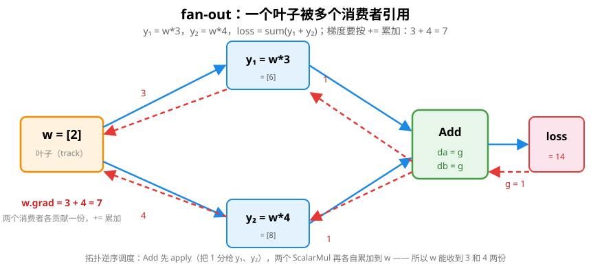
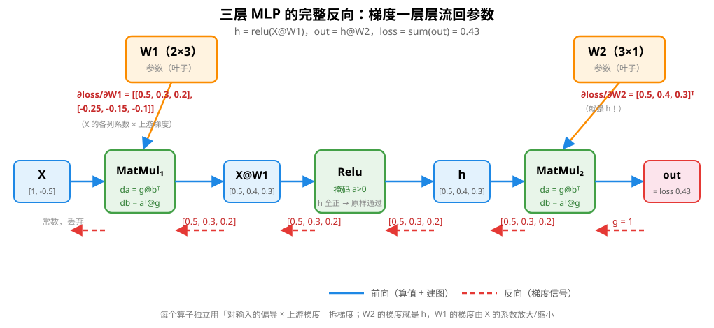

# 自动求导：梯度是怎么"算"出来的

> 对应代码：`include/mini_mlmath/autograd.h`
> 前置阅读：[激活函数](activation.md)（"多层要反向传播 → 要算梯度 → 用链式法则"那条链条）、[线性回归](linear_regression.md)（手写梯度下降的出处）

训练神经网络，本质上就是在反复做一件事：**算一个 loss 对每个参数的导数（梯度），然后往梯度反方向改参数**。手写模型时（比如 `linear_regression.h` 里的 `fit`），每个模型的梯度公式都要自己推、自己写。但模型一复杂，公式就推不动了——**自动求导（Autograd）是"让框架替你把链式法则跑一遍"**。本文就用 `autograd.h` 讲清楚它内部到底怎么算。

## 1. 核心思想：把计算记下来，然后反着用链式法则

梯度下降需要 `∂loss/∂w`。链式法则是这么说的：

```
∂loss/∂w = (∂loss/∂中间结果) × (∂中间结果/∂w)
```

问题在于这个"中间结果"有很多层，每个中间量都只对自己的输入求导。**自动求导的全部秘密，就是把每次运算连成一张图，然后从终点（loss）开始，反着把每个算子的局部导数串起来相乘**。

先记住四个字：**前向建图，反向传值**。

```
前向（算结果，同时记下"这步是怎么算出来的"）：
    x → [算子] → 中间量 → [算子] → 中间量 → ... → loss

反向（从 loss 出发，把梯度信号反着传回去）：
    loss  ←  梯度信号  ←  梯度信号  ←  ...  ←  每个参数
```



图中每个"算子"框在代码里就是张量身上的 `grad_fn`；蓝色箭头走一遍的是"值"，红色虚线倒着走一遍的是"梯度信号"。

## 2. 计算图到底记了什么

以 `autograd.h` 的实现为例，每个由算子产生的张量身上挂着一个 `grad_fn`（反向节点）。一个节点记两样东西：

1. **前向时的输入张量**（算局部梯度要用它们的值）
2. **一个反向函数 apply()**（"收到上游梯度后，怎么拆给每个输入"）

```
        ┌────────────────────────────┐
        │       MulNode（反向节点）     │
        │                            │
输入 a ─┼─► 记下 a（值要用来算 db）      │
        │                            │
输入 b ─┼─► 记下 b（值要用来算 da）      │
        │                            │
输出 y ─┼─► y 挂上 grad_fn = 本节点     │
        └────────────────────────────┘
```

`autograd.h` 里就是这么干的：`y = a * b` 时，`y` 的 `Impl::grad_fn` 指向一个 `MulNode`，节点里存着 `a`、`b` 两个句柄。

## 3. 先看一个完整的小例子（手算一次反向）

```
参数 w = [3, 4]       数据 a = [1, 2]（常数）
y = a ⊙ w = [3, 8]   （逐元素乘）
loss = sum(y) = 11
```

### 第一步：前向建图

```
a ─┐
   ├──[MulNode]──► y ──[SumNode]──► loss
w ─┘
```

前向只做两件事：算出 `y=[3,8]`、`loss=11`，并给每个结果挂上反向节点。**前向不碰梯度**。

### 第二步：反向传梯度（关键）

从 loss 出发，初始梯度定为 `1`（loss 对自身的导数当然是 1，`autograd.h` 里写成全 1 矩阵）。

**第 1 个节点：SumNode**

Sum 把所有元素加成一个数，那"loss 对 y 的每个元素"的导数都是 1：

```
SumNode 收到上游梯度 g = 1
拆给 y：   y.grad = [1, 1]        ← 形状和 y 一样，每个元素都分到 1
```

**第 2 个节点：MulNode**

Mul 的反向公式（就是链式法则）——`yᵢ = aᵢ·bᵢ`，所以：

```
∂loss/∂aᵢ = gᵢ · bᵢ       ∂loss/∂bᵢ = gᵢ · aᵢ

MulNode 收到上游梯度 g = [1, 1]（就是 y.grad）
拆给 a：   a.grad += [1,1] ⊙ b = [1·3, 1·4] = [3, 4]
拆给 w：   w.grad += [1,1] ⊙ a = [1·1, 1·2] = [1, 2]
```

验证一下：`∂loss/∂aᵢ = ∂(Σ aⱼbⱼ)/∂aᵢ = bᵢ`，所以 a 的梯度确实是 `[3,4]`、w 的梯度是 `[1,2]`。✓

**注意那个 `+=`**：梯度是**累加**的，不是赋值。因为同一个张量可能被多个节点用到（见第 5 节）。



把上面三步连起来看这张图：`loss` 处放下初始梯度 1 → `SumNode` 把 1 复制成 `[1,1]` 给 `y` → `MulNode` 用公式 `da=g⊙b`、`db=g⊙a` 把梯度拆回两个叶子。

## 4. 每个算子的局部公式表（本库全套）

`autograd.h` 里每个节点就是一个公式，全部写死在前向代码里。这张表背下来就掌握了自动求导的一半：

| 算子 | 前向 | 反向（收到上游梯度 g 后） |
|---|---|---|
| 加 `y=a+b` | `a+b` | `da = g`，`db = g` |
| 减 `y=a-b` | `a-b` | `da = g`，`db = -g` |
| 逐元素乘 `y=a⊙b` | `a⊙b` | `da = g⊙b`，`db = g⊙a` |
| 逐元素除 `y=a/b` | `a/b` | `da = g/b`，`db = -g·a/b²` |
| 标量乘 `y=a·s` | `a·s` | `da = g·s` |
| 矩阵乘 `y=a@b` | `a@b` | `da = g@bᵀ`，`db = aᵀ@g` |
| 求和 `y=sum(a)` | `Σaᵢ` | `da = 把 g 填满成 a 的形状` |
| ReLU `y=relu(a)` | `max(0,a)` | `da = g ⊙ (a>0)` |

别死记，看规律：**"反向公式 = 对输入求偏导 × 上游梯度"**，而"对输入求偏导"就是链式法则里那一项。比如乘法对 b 求偏导是 a（把 b 当变量、a 当常数），所以 `db = g·a`。



每个节点的工作被这张图概括：前向时把输入的值记进节点（公式要用）；反向时收到"上游梯度 g"，用一个局部公式把它拆成每个输入该拿的梯度，累加进输入的 grad。

### 矩阵乘的三个直觉

`y = a@b`（a 是 M×K，b 是 K×N）是唯一反向公式"看起来不对称"的：

```
da = g @ bᵀ      ← g 是 M×N，bᵀ 是 N×K，乘起来 M×K，正好是 a 的形状
db = aᵀ @ g      ← aᵀ 是 K×M，乘起来 K×N，正好是 b 的形状
```

`autograd.h` 里这行代码和公式长得一模一样：

```cpp
this->accumulate(a_, g * this->val(b_).transposed());
this->accumulate(b_, this->val(a_).transposed() * g);
```

为什么？把 `yᵢⱼ = Σₖ aᵢₖbₖⱼ` 对 `aᵢₖ` 求偏导：只有 `y` 的第 i 行、所有 j 都含 `aᵢₖ`，且偏导是 `bₖⱼ`。把 g 的 i 行和 b 的第 k 行做内积，正好是 `(g@bᵀ)ᵢₖ`。**矩阵乘的反向还是矩阵乘**——这是它最优雅的地方，也解释了为什么自动求导能在深度学习里规模化（GPU 上正反向都吃矩阵乘的算力）。

## 5. 为什么必须拓扑排序

上面的例子是一条直线，反着走一遍就行。但真实计算里张量会被**复用**（fan-out）：

```
w ──► y1 = w * 3   ─┐
                     ├──► loss = sum(y1 + y2)
w ──► y2 = w * 4   ─┘
```

如果反向时 `w` 被反向"走"两次，它的梯度必须**两次都累加**：

```
∂loss/∂w = ∂loss/∂y1 · ∂y1/∂w + ∂loss/∂y2 · ∂y2/∂w = 3 + 4 = 7
```

`autograd.h` 的处理是：反向前先做一次**后序遍历**，把整张图的节点按"先依赖、后自身"排成一个列表，然后**逆序执行**每个节点的 apply()：

```
收集到的拓扑序（依赖在前）：[MulNode(y1), MulNode(y2), AddNode]
逆序执行：                    AddNode → MulNode(y2) → MulNode(y1)
```

为什么逆序就对了？因为**任何节点的上游梯度，一定由它的"下游"（消费它的节点）先算好**。逆序保证消费者先跑，生产者后跑——生产者跑的时候，它的输出张量上已经攒齐了所有消费者的贡献。



看图上红色箭头：`Add` 先把梯度 1 分给 `y₁`、`y₂`，两个乘法节点再把 `3` 和 `4` 分别累加进 `w.grad`，最终 `w.grad = 7`。**每个消费者贡献一份，靠 `+=` 而不是 `=` 加在一起**。

> 这正是我们之前聊的"SQL 执行器 DAG"和 autograd 的计算图**最像的地方**：都有"按依赖顺序调度节点"这一步。区别只是：SQL 先规划后执行，autograd 前向时边算边建图、反向再调度。

## 6. 一个三层 MLP 的完整手算（看梯度一层层"流"）

用测试里那个小网络，把梯度真正手算一遍（数据 `X=[1, -0.5]`，权重 `W1` 2×3、`W2` 3×1）：

```
h = relu(X @ W1)        # 1×3
out = h @ W2            # 1×1
loss = sum(out)         # 就是 out 本身
```

已知 `X@W1 = [0.5, 0.4, 0.3]`（全 >0，relu 不动），`out = 0.5·0.5 + 0.4·0.3 + 0.3·0.2 = 0.43`。



这张图把 6 节的整条反向过程画全了：红色箭头是梯度信号，从 `out`（g=1）一路传回参数；注意每个算子的局部公式是独立算的，链式法则负责把它们串起来——`W2` 的梯度恰好是 `h`，`W1` 的梯度是 `X` 的各列系数把上游梯度放大/缩小后的结果。

反向从 loss=1 开始，一层层拆：

**第 1 层（Sum/恒等 → MatMul2）**：`∂loss/∂h = W2ᵀ = [0.5, 0.3, 0.2]`（因为 `out = h@W2`，对 h 求导就是 W2ᵀ）。

**第 2 层（MatMul2 对 W2）**：`∂loss/∂W2 = hᵀ @ 1 = [0.5, 0.4, 0.3]ᵀ`——所以 **W2 的梯度就是 h**，`[0.5, 0.4, 0.3]ᵀ`。

**第 3 层（Relu）**：h 全 >0，relu 导数全 1，梯度原样穿过：`∂loss/∂(X@W1) = [0.5, 0.3, 0.2]`。

**第 4 层（MatMul1 对 W1）**：`∂loss/∂W1 = (X@W1 的上游梯度) 传给 W1`，即：

```
∂loss/∂W1 = [0.5, 0.3, 0.2] 对应的 X 各列系数
         = [0.5·1,   0.3·1,   0.2·1  ]   = [0.5, 0.3, 0.2]      ← W1 第一行
           [0.5·-0.5, 0.3·-0.5, 0.2·-0.5] = [-0.25, -0.15, -0.1] ← W1 第二行
```

`autograd_test.cpp` 用有限差分对拍过这组梯度，误差 ~4×10⁻¹¹。**注意这个手算过程**：每个算子的局部梯度公式独立使用，结果由链式法则自动"串"起来——这就是自动求导的全部。

## 7. 叶子才存梯度：`grad` 和 `zero_grad`

反向时，梯度一路累加进"输入"的 grad 缓冲，但**只有叶子张量（自己创建、track=true 的参数）的 grad 会留下来给你用**。为什么中间张量不留？

- 中间张量的梯度是中间产物，用完就丢，没必要占内存（`backward` 每次开始前把中间节点的 grad 清零）；
- 叶子是"你亲手创建、能 set_value 修改"的，它的梯度才是有意义的更新方向。

所以训练循环长这样（对应 `autograd.h` 的 `zero_grad` / `set_value`）：

```cpp
for (int iter = 0; iter < iters; ++iter) {
    w.zero_grad();                 // 1) 清掉上一轮的叶子梯度
    auto loss = ...;               // 2) 前向建图
    loss.backward();               // 3) 反向，梯度累加到叶子 w.grad
    w.set_value(w.value() - lr * w.grad());   // 4) 手动 SGD 更新
}
```

第 1 步为什么必须？看第 5 节的 `+=` 语义：梯度是累加的。**如果不清零，上一轮的梯度会一直叠加**——`backward` 对叶子的行为就是"往已有值上继续加"（这其实是 PyTorch 的 accumulate 语义，方便小批量内多次 forward 后统一反向）。

## 8. 常数为什么不追踪

数据 `x`、标签都不需要梯度。`Tensor<T>(x, false)` 构造的常数张量 `track=false`：前向照常参与计算（节点的公式要用它的值），但反向时 `accumulate` 直接跳过它。

```cpp
// autograd.h 里累加梯度的唯一入口
void accumulate(const Tensor<T>& in, const Matrix<T>& g) {
    if (!in.requires_grad()) return;   // 常数：直接丢弃
    in.p_->grad += g;                  // 参数：累加
}
```

这么做的意义是**省内存和时间**：数据通常很大（整个数据集），如果给它们也建反向节点、存梯度，图会膨胀几十倍。`track=false` 让数据张量"值参与、梯度不参与"。

## 9. 图是怎么被释放的（out_ 用非拥有指针，避免循环引用）

这是个容易踩的坑：节点持输入句柄，而每个张量又持"产生它的节点"（`grad_fn`）。如果节点**也**用 shared_ptr 持有输出张量，就会形成：

```
输出张量 ──grad_fn──► 节点 ──out_(shared_ptr)──► 输出张量   ← 互相牵着，永不释放
```

`Impl ⇄ GradNode` 两边都是强引用，引用计数永远不为 0——图释放不掉，训练循环里每轮丢弃旧图就是**内存泄漏**（这个 bug 真实踩过，已修复）。

本库的解法：**节点对输出用裸指针（不拥有），只对输入用 shared_ptr（拥有）**：

```
输出张量 ──shared──► 节点 ──shared──► 输入张量 ──shared──► 更早的节点 ──► ...
输出张量 ◄──裸指针── 节点（不增加引用计数）
```

这样引用严格单向（张量→节点→更早的张量），**无环**。而且裸指针安全：节点被输出张量通过 `grad_fn` 持有，所以"节点活着 ⇒ 输出活着"，节点访问输出时它必然还在。

`autograd.h` 里用一个静态计数器 `GradNode::live_count_` 来验证这一点：`autograd_test.cpp` 的「图释放无泄漏」测试建 200 轮图全部丢弃后，活节点数回落为 0。

> 对比 PyTorch 需要一套 intrusive_ptr + 版本计数器，是因为它有 view 共享存储、in-place 修改这些更复杂的语义。教学版砍掉这些，用「输出持节点、节点持输入」+ 输出端裸指针就够了。

## 10. 一句话总结

```
前向：算值 + 给每个结果挂 grad_fn（记下输入和局部导数公式）→ 建成一张 DAG
反向：loss 处放一个初始梯度 1
      → 按拓扑序逆序，依次调用每个节点的 apply()
      → 每个节点用「对输入的偏导 × 上游梯度」把梯度拆给输入
      → 叶子张量的 grad 里累加出最终梯度
```

梯度 = 链式法则的自动执行。`autograd.h` 里你能"看到"的全部智力，就是那张第 4 节的公式表——其余全是调度（拓扑序）和记账（谁生产了谁）的体力活。

## 11. 延伸阅读

- [线性回归](linear_regression.md)：手写梯度下降的样子（`autograd.h` 就是把这部分自动化）
- [激活函数](activation.md)：ReLU 的导数为什么是"掩码"，反向时发生了什么
- 本库 `autograd_test.cpp`：MLP 梯度与数值有限差分对拍，是验证反向实现的标准手法
- 反向模式自动求导（reverse-mode AD）：本文讲的就是它。还有"前向模式"（forward-mode AD），适合"一个输入、多个输出"的场景
- 版本计数器（version counter）：PyTorch 检测"图建好后张量被 in-place 改脏"的机制，本库用"先 forward 后立刻 backward"的约定绕开了它
