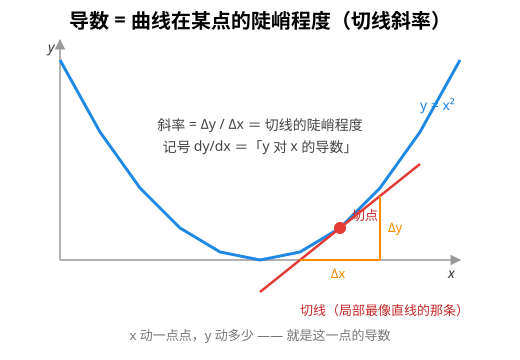
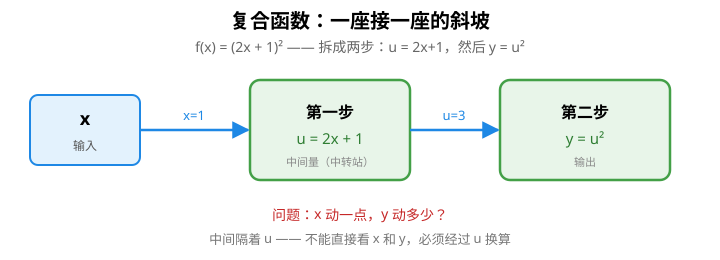
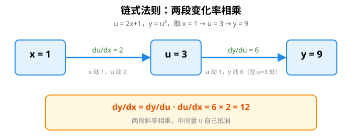
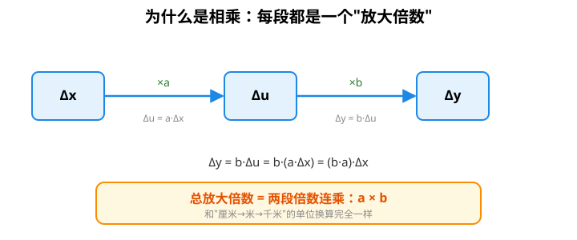
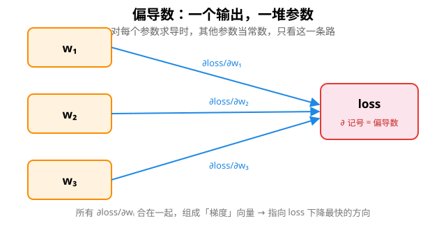
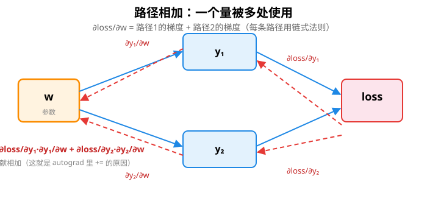
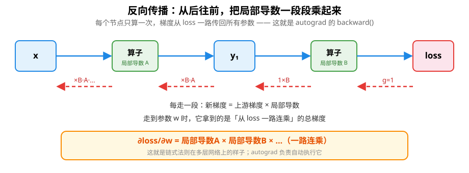
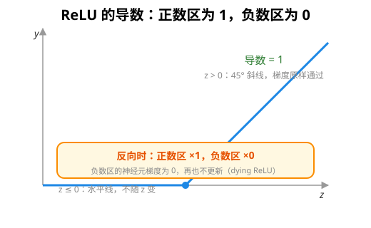
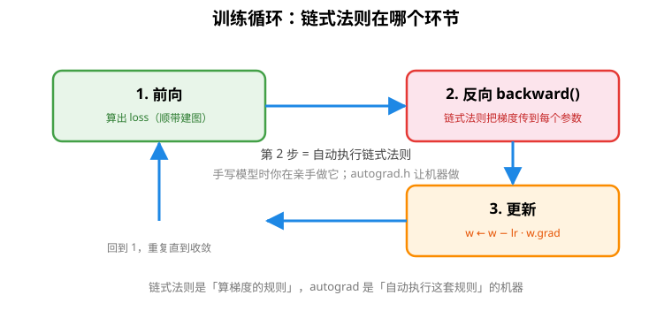

# 链式法则：零基础一次搞懂（反向传播的地基）

> 前置阅读：无。本文假设你把"导数"也忘光了，从零讲起。
> 衔接阅读：[自动求导](autograd.md)（链式法则就是 autograd 内部那条链式法则）

如果你看过本库的 [自动求导](autograd.md)，会看到反向传播每走一步都在做同一件事：**拿"上游梯度"乘一个"局部导数"**。那个"局部导数"是从哪来的？——就是链式法则。这篇文档把链式法则从"导数是什么"开始讲清楚，不讲微积分公式推导，只讲直觉 + 数值例子，保证零基础也能懂。

## 1. 导数是什么：一座斜坡的陡峭程度

先忘掉"极限""微积分"这些词。**导数衡量的是：当输入动一点点，输出动多少**——也就是函数曲线在某一点的**陡峭程度**（斜率）。



想象你站在一条山路上：往前走 1 米，海拔升高 0.5 米，那这段路的"陡峭度"就是 `0.5/1 = 0.5`。函数的导数就是这种"每前进一格、上升几格"的比率：

```
斜率 = 上升量 / 前进量 = Δy / Δx
```

### 两个最简单例子（记住就够用）

**例 A：直线 `y = 3x`**。x 每加 1，y 就加 3，斜率处处是 3，也就是 `dy/dx = 3`。

**例 B：抛物线 `y = x²`**。它的斜率不是固定值——在 x=1 处陡峭度是 2，在 x=2 处是 4，在 x=3 处是 6。规律是 `dy/dx = 2x`（在哪个点取值，就在那个点算 2x）。

> 记号说明：`dy/dx` 就是"y 关于 x 的导数"，读作"y 对 x 的导数"，别把它当成除法，就当成**"x 动一点，y 动多少"的比率**。

## 2. 复合函数：一座接一座的斜坡

现在来了真问题。看这个函数：

```
f(x) = (2x + 1)²
```

它其实是**两步变换**：先算 `u = 2x + 1`，再把 u 平方成 `y = u²`。



问：**x 动一点，y 到底动多少？** 直接回答不了——因为中间隔了一个 u。x 的变化要先传给 u，u 的变化再传给 y。这就好比你要从"输入"走到"输出"，中间必须经过一个中转站 u。

## 3. 链式法则：让"中间人"帮你换算

链式法则就一句话：**y 对 x 的变化率 = y 对 u 的变化率 × u 对 x 的变化率**

```
dy/dx = dy/du · du/dx
```

为什么对？逻辑上是"接力"：x 每动一点 → 先让 u 动 `du/dx` 那么多 → u 每动一点又让 y 动 `dy/du` 那么多。所以 x 动一点，y 总共动 `(dy/du) × (du/dx)`。

### 数值例子（带具体数字走一遍）

还是 `y = u²`，`u = 2x + 1`，假设 x = 1：

```
x = 1  →  u = 2·1 + 1 = 3  →  y = 3² = 9

第 1 段：u = 2x + 1，   x 每动 1，u 动 2      →  du/dx = 2
第 2 段：y = u²，       u = 3 处，y 对 u 的导数 = 2·3 = 6   →  dy/du = 6

链式法则：dy/dx = dy/du · du/dx = 6 · 2 = 12
```



验证一下是不是 12：把 `u = 2x+1` 代回去，`y = (2x+1)²`，展开求导（或直接想）在 x=1 处确实等于 12。✓ **两段"小变化率"相乘，中间量 u 自己抵消了**——这是整个链式法则的灵魂。

## 4. 为什么链式法则是对的：变化量相乘 + 放大镜直觉

光记住公式不够，理解"为什么乘"才不会用错。看变化量怎么传递：

```
x 动 Δx
  → u 动了 Δu ≈ (du/dx)·Δx       （第 1 段：把 Δx 放大 du/dx 倍）
  → y 动了 Δy ≈ (dy/du)·Δu       （第 2 段：把 Δu 放大 dy/du 倍）
  → Δy ≈ (dy/du)·(du/dx)·Δx      （两个倍数连乘）
所以 dy/dx = (dy/du)·(du/dx)      （两边除以 Δx）
```



这个直觉和"单位换算"一模一样：

```
距离(千米) = 距离(米) × 0.001
距离(米)   = 距离(厘米) × 0.01
⇒ 距离(千米) = 距离(厘米) × 0.01 × 0.001 = × 0.00001
```

**两个换算系数连乘**，和链式法则的"两个导数连乘"是同一件事。这也是"放大镜"直觉的由来：函数局部看就是一条直线（小放大镜里曲线≈直线），直线的斜率就是倍数，几段直线连起来，总倍数自然连乘。

> 所以链式法则的两个要点，只要记住"**相乘**"和"**在对应点取值**"即可——每段的导数都要在**当时那个输入值**上算（比如上面 dy/du 是在 u=3 处算的 6，不是别处的 u）。

## 5. 多个输入：偏导数（一个输出，一堆参数）

机器学习的 loss 依赖成百上千个参数。此时"导数"变成**偏导数**：对某一个参数求导时，把其他参数当常数，只看**这一条**输入通路。



```
∂loss/∂w₁ = 只看 w₁ 那条路，其他参数当常数
∂loss/∂w₂ = 只看 w₂ 那条路
...
```

记号从 `d` 变成 `∂`，意思就是"这一个变量的偏导数"。本质上和一元导数没区别，只是"一次只看一条路"。

## 6. 多条路径要相加：路径相加法则（fan-out 的数学基础）

如果**同一个中间量被多个地方使用**，事情就来了：loss 对它的总梯度，等于**每条路径贡献的梯度之和**。



```
∂loss/∂w = ∂loss/∂y₁ · ∂y₁/∂w + ∂loss/∂y₂ · ∂y₂/∂w
```

这就是本库 [自动求导](autograd.md) 里 fan-out 那张图背后的数学：`w` 被 `y₁ = w*3`、`y₂ = w*4` 都用，最终 `w.grad = 3 + 4 = 7`——**每个消费者各贡献一份，加在一起**。这也是为什么 autograd 里梯度用 `+=` 累加而不是 `=` 赋值。

## 7. 反向传播：从后往前乘（链式法则的正确打开方式）

现在把链式法则用在多层网络上。假设：

```
loss = sum(relu(X@W1) @ W2)
```

你想对每个参数（W1、W2 里每个元素）求偏导。**如果从前往后算**，每个参数的梯度都要从 loss 一路乘下来，会重复计算大量中间结果。**反过来算**就高效得多：

```
从后往前，每经过一个节点，只把上游梯度 × 局部导数，传给下游节点。
每个节点只算一次，梯度像信号一样从 loss 一路传回所有参数。
```



这正是 [自动求导](autograd.md) 里 `backward()` 干的事——所以那个文档里反复出现的 `apply()`，本质就是"执行这一小段链式法则"：**拿上游梯度 g，乘上局部导数公式（da=g⊙b 之类），传给输入**。

## 8. 用 ReLU 亲手试一次（本库就有）

本库 `activation.h` 的 ReLU：`relu(z) = max(0, z)`。它的导数是——**掩码**：



```
z > 0 时：relu(z) = z，  导数 = 1
z ≤ 0 时：relu(z) = 0，  导数 = 0（不随 z 变）
```

链式法则用起来：反向时梯度穿过 relu 层，正数区域**原样通过**（×1），负数区域**变成 0**（×0，这个神经元再也不更新——就是文档里说的 dying ReLU）。一个简单的"乘 0 或乘 1"就是一段链式法则。

## 9. 链式法则在整个训练里的位置

梯度下降训练 = 反复执行这个循环：



```
1. 前向：算出 loss（顺便建图）
2. 反向：backward() —— 从 loss 出发，链式法则把梯度传到每个参数
3. 更新：w ← w − lr · w.grad
4. 回到 1
```

链式法则是"**算梯度的规则**"，autograd 是"**自动执行这套规则**的机器"。你手写模型时（`linear_regression.h` 的 fit）就是在亲手做第 2 步；用 `autograd.h` 时，机器替你做。

## 10. 常见误区

| 误区 | 说明 |
|---|---|
| 把 `dy/dx` 当成分数直接约分 | 直觉上可以当"变化率之比"，但它不是真分数，约分只在记号层面"碰巧成立" |
| 忘了"在对应点取值" | `dy/du` 要在 `u` 的实际值处算，`du/dx` 要在 `x` 的实际值处算，位置错了全错 |
| 忽略路径相加 | 一个量被多处使用时，梯度是所有路径之和（fan-out） |
| 分不清方向 | `dy/du` 和 `du/dy` 是倒数关系但数值完全不同，先想清楚"谁影响谁" |
| 以为链式法则只是"一层" | 它层层可套：三层就是 `dy/dx = (dy/dv)·(dv/du)·(du/dx)`，n 层连乘 n 段 |

## 11. 自测练习（先自己想，再看答案）

**题 1**：`y = u³`，`u = x + 5`。求 x = 1 处的 `dy/dx`。
（提示：先算 u 的值，再算两段导数相乘）

**题 2**：`f(x) = (3x)²`。不求展开，直接用链式法则求 `df/dx`，并和"展开后求导"核对。

**题 3**：反向传播里，一个中间量被两个上层节点使用，上游分别给梯度 2 和 3，它传给下游的总梯度是几？

<details><summary>答案</summary>

**题 1**：x=1 → u=6；`du/dx = 1`；`dy/du = 3u² = 3·36 = 108`；`dy/dx = 108 × 1 = 108`。

**题 2**：记 u=3x（du/dx=3），y=u²（dy/du=2u=6x）。`df/dx = 6x · 3 = 18x`。展开核对：`(3x)² = 9x²`，求导 `18x`。✓

**题 3**：2 + 3 = 5（路径相加法则）。
</details>

## 12. 延伸阅读

- [自动求导](autograd.md)：链式法则的"自动化执行"，每个算子的局部公式表就是一堆链式法则
- [激活函数](activation.md)：ReLU / sigmoid 的导数（反向时乘的那个数）
- [线性回归](linear_regression.md)：手写梯度下降（亲手做链式法则的模型）
- 偏导数与梯度：一个 loss 对很多参数的偏导组成向量，叫梯度（指向下降最快的方向）
