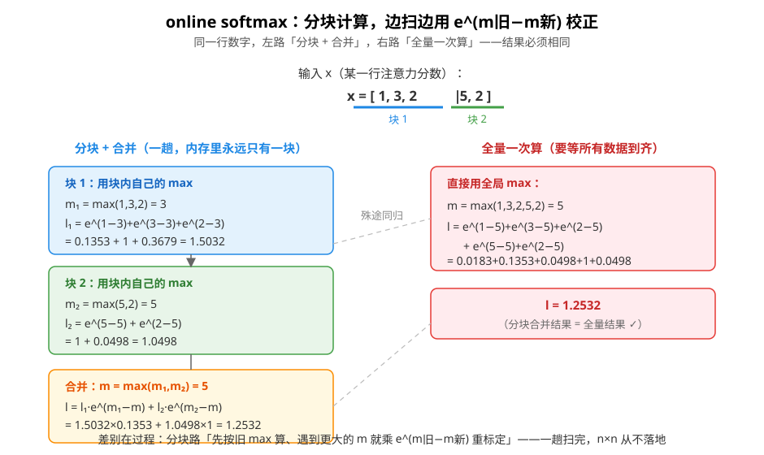
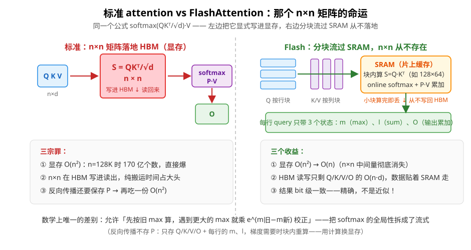

# FlashAttention：把注意力塞回 SRAM 的艺术（从 0 开始）

> 对应代码：`include/mini_mlmath/softmax.h`（safe softmax / online softmax 的地基）
> 前置阅读：[Softmax](softmax.md)（减 max 救命符——本文从它一路推到 FlashAttention）、[正弦位置编码](positional_encoding.md)（注意力的另一个组件）
> 仓库彩蛋：`softmax.h` 末尾埋过一句话——「在线 softmax（flash-attention 用的就是它）……那是下一个教学主题」。本文就是那个主题。

FlashAttention 一句话：**用「分块 + 在线 softmax」重排注意力的计算顺序，让 n×n 的注意力矩阵从头到尾不落显存——同样的数学结果，完全不同的内存轨迹。** 它不是近似算法（结果和标准注意力 bit 级一致），是纯粹的「换个顺序算」。

本文从第 0 步的标准注意力开始，一步步推到完整算法。每一小步只引入一个新困难 + 一个对应的解法，读完你能自己写出伪代码。

## 0. 起点：标准注意力回顾

```
Attention(Q, K, V) = softmax(Q·Kᵀ / √d) · V

Q: n × d     （n 个 query，每个 d 维）
K: n × d
V: n × d
S = Q·Kᵀ/√d:  n × n     ← 每个 query 对每个 key 的「相关度分数」
P = softmax(S, 按行): n × n  ← 每行归一化成权重
O = P·V:      n × d     ← 权重加权求和 value
```

直觉：**softmax(QKᵀ) 是「可微的软检索」**——第 i 个 query 对全部 key 打分，softmax 把分数变成「注意力预算」（每行和为 1），再按预算混合 value。每个输出 `O_i` 是所有 `V_j` 的加权平均，权重就是 `P_i,j`。

一切的问题都出在那个 **n×n** 上。

## 1. n×n 矩阵的三宗罪

**罪一：显存 O(n²)。** 存 `S` 和 `P` 各要 n² 个数。n=2048 时是 400 万；n=128K（长上下文时代）时是 170 亿——**没等算，先爆显存**。训练时它还得进计算图保存给反向传播，雪上加霜。

**罪二：它是「中间结果」，必须落地。** GPU 的计算要求数据在显存（HBM）里，而 n×n 矩阵大到 SRAM（片上缓存）装不下——于是它被**写进 HBM，下一行算式再从 HBM 读回来**。写进去、读出来，纯搬运就占掉大头时间。

**罪三：序列越长越惨。** 注意力是 transformer 里唯一 O(n²) 的部件。序列翻倍，显存×4、搬运×4，而其它部件只是×2。长上下文的「不可能三角」主要卡在这。

## 2. GPU 的真相：算得快，搬得慢

现代 GPU 的算力和带宽严重不对称：

| 层级 | 位置 | 容量 | 带宽（量级）|
|---|---|---|---|
| SRAM | 片上（每个 SM）| ~20 MB 总量 | **~19 TB/s** |
| HBM | 显存（片外）| 40~80 GB | ~2~3 TB/s |

差距接近 **10 倍**，且容量差 3~4 个数量级。所以一个残酷的事实是：

> **矩阵乘法本身（FLOPs）很便宜，把中间结果在 HBM 里搬进搬出（IO）才贵。** 算力利用率上不去，很多时候不是在「算」，是在「等数据」。

FlashAttention 的立论（论文标题就叫 *FlashAttention: Fast and Memory-Efficient Exact Attention with IO-Awareness*）：既然瓶颈是 IO，那就**把计算重排成「数据在 SRAM 里算完才出来」**——这就是「Flash」的含义：数据像闪光一样流过片上缓存，从不驻留显存。

要做到这一点，必须**分块**（tiling）。但分块有一个拦路虎。

## 3. 拦路虎：softmax 是「全局」的

矩阵乘法天然可分块：`(A·B)·C = A·(B·C)`，块乘块加起来就行。但 softmax 不行——看它的定义：

```
softmax(x)_i = exp(x_i) / Σ_j exp(x_j)
```

分母是**全体** j 的和。你分块算到一半时，手里只有半截 x，分母还没凑齐。更麻烦的是数值稳定版（[Softmax](softmax.md) 讲过）还要先减**全局** max：

```
softmax(x)_i = exp(x_i - m) / l      其中 m = max(x), l = Σ_j exp(x_j - m)
```

m 和 l 都要**全局**信息。分块算块 1 的时候，既不知道后面块的 max（可能把 m 顶掉），也不知道后面的 sum。**这就是为什么标准实现必须先把整个 n×n 算完存下来**——softmax 的全局性逼你落地。

FlashAttention 的全部数学，就是回答一个问题：

> **能不能「先斩后奏」——先按临时 max/sum 算着，扫到新块时再把老的校正过来？**

答案是可以。分三步推导。

## 4. 第一步：safe softmax（你已经会了）

`softmax.h` 实现的减 max 版本，把 m 提出来了：

```
softmax(x)_i = exp(x_i - m) / l
```

它是后面一切的地基。现在把「怎么算 m 和 l」当主角来审视。

## 5. 第二步：两趟算法（two-pass）——还差一口气

最直观的分块方案：

```
第 1 趟：扫完所有块，求出全局 m 和 l
第 2 趟：再扫一遍，算 exp(x_i - m) / l
```

可行，但两个选择都疼：
- 要么把 x（= n×n 的 S 矩阵）**存下来**等第二趟用 → 显存 O(n²)，回到原点；
- 要么第二趟**重算** x → QKᵀ 算两遍，计算翻倍。

两趟算法的本质困境：**max 和 sum 是「先全局、后局部」的依赖**。想要一趟，就得允许「用错的先算，之后校正」。

## 6. 第三步：online softmax——一趟搞定（核心数学）

把 x 切成两块：`x = [x⁽¹⁾ | x⁽²⁾]`。

**块 1 照常算**（用块内自己的 max）：

```
m₁ = max(x⁽¹⁾)
l₁ = Σ_{j∈块1} exp(x⁽¹⁾_j - m₁)
```

**块 2 也照常算**：

```
m₂ = max(x⁽²⁾)
l₂ = Σ_{j∈块2} exp(x⁽²⁾_j - m₂)
```

**关键：合并公式**。真正的 l 应该是「大家都减全局 m」的和：

```
l = Σ_j exp(x_j - m)，m = max(m₁, m₂)
```

把块 1 的和改写一下（配个因子）：

```
Σ_{j∈块1} exp(x_j - m) = Σ_{j∈块1} exp(x_j - m₁) · exp(m₁ - m)
                        = l₁ · exp(m₁ - m)
```

于是：

```
l = l₁·e^(m₁-m) + l₂·e^(m₂-m)      ← 老块乘 e^(m₁-m) 重标定，新块乘 e^(m₂-m)
```

**这就是 online softmax 的全部秘密**：块内先用自己的 max 算，合并时用 `e^(m_old - m_new)` 因子把「按旧 max 算的结果」校正成「按新 max 应有的值」。扫完最后一块时，m 和 l 自然就是全局的——**一趟完成**。

### 数值例子（手算可验证）

```
x = [1, 3, 2 | 5, 2]        分两块：x⁽¹⁾=[1,3,2]，x⁽²⁾=[5,2]

块 1：m₁ = 3
     l₁ = e^(1-3) + e^(3-3) + e^(2-3) = 0.1353 + 1 + 0.3679 = 1.5032

块 2：m₂ = 5
     l₂ = e^(5-5) + e^(2-5) = 1 + 0.0498 = 1.0498

合并：m = 5
     l = l₁·e^(3-5) + l₂·e^(5-5)
       = 1.5032 × 0.1353 + 1.0498 × 1
       = 0.2034 + 1.0498 = 1.2532
```

直接全量验算：

```
l = e^(1-5) + e^(3-5) + e^(2-5) + e^(5-5) + e^(2-5)
  = 0.0183 + 0.1353 + 0.0498 + 1 + 0.0498 = 1.2532  ✓ 一趟 = 两趟
```



## 7. 第四步：加上 V——FlashAttention 完整算法

注意力是 `softmax(S)·V`，不止要 softmax，还要**乘 V 累加**。分块处理 K/V 时，输出 `O_i` 也要「先算后校正」：

```
已扫块的输出（按旧 max 算的）：O_old = Σ_{j∈已扫} exp(S_j - m_old)·V_j
真正想要的（按新 max）：        Σ_{j∈已扫} exp(S_j - m_new)·V_j
                              = O_old · e^(m_old - m_new)      ← 同一个校正因子！
```

**O 和 l 用的是同一个校正因子 `e^(m_old - m_new)`**——这是 FlashAttention 公式里最漂亮的一点。完整算法（论文 Algorithm 2 的教学版）：

```
输入：Q (n×d)，K (n×d)，V (n×d)；块大小 Br（query 行块）、Bc（key 列块）

对每个 query 行块 Q⁽ⁱ⁾ (Br×d)：                    # 外层
    m = -∞;  l = 0;  O = 0 (Br×d)                 # 该块所有 query 行的运行状态
    对每个 key/value 列块 K⁽ʲ⁾, V⁽ʲ⁾ (Bc×d)：      # 内层：扫一遍全部列块
        S = Q⁽ⁱ⁾·(K⁽ʲ⁾)ᵀ / √d                     # Br×Bc —— 只在 SRAM 里存在！
        m_new = rowmax(S) 与 m 逐行取 max          # 新的（暂时）全局 max
        P = exp(S - m_new)                         # 逐元素
        l = l·e^(m - m_new) + rowsum(P)            # 老的乘校正因子，加新块的
        O = O·e^(m - m_new) + P·V⁽ʲ⁾              # 输出同样：老的乘校正，加新块的
        m = m_new
    O = O / l                                      # 分母最后才除（见下）
```

逐行品味：

- **`S` 和 `P` 只有 Br×Bc**（比如 128×64），算完这个块就被覆盖，**从不写回 HBM**——n×n 矩阵在整段代码里没有任何变量承接它；
- **`O = O·e^(m-m_new) + P·V`** 是在线 softmax 校正公式和矩阵乘的合体：老输出按新 max 重标定，新块贡献直接加上；
- **分母最后才除**：中间一直不除 l，只在最后 `O / l`。这不仅是省除法——如果每块都除，校正因子就不再是一个干净的 `e^(m-m_new)`（论文的原版更绕），「后除」让公式保持简单；
- 循环结构是「**每个 Q 块 × 扫全部 K/V 块**」：外层 Q 块之间完全独立（天然并行），内层串行扫描累积状态。



## 8. 反向传播怎么办：用计算换显存

训练需要梯度。标准实现的反向传播要用到 `P`（softmax 的输出）——存它正是 O(n²) 的元凶之一。

FlashAttention 的做法：

- **不存 P**，只存 `Q, K, V, O` 和每行的 `m, l`（每行就 2 个标量，O(n)）；
- 反向时**用存下的量把 S 和 P 重算出来**（块内现算现用），套 softmax 的雅可比公式得到 `dP`，再对 Q/K/V 求梯度。

这就是 **activation checkpointing** 的思想：**用一次重算换掉 O(n²) 的显存**。在「算力便宜、带宽/显存贵」的 GPU 上，这笔交易稳赚。

## 9. 效果盘点与版本演进

| | 标准注意力 | FlashAttention |
|---|---|---|
| 显存（attention 部分）| O(n²) | **O(n)** |
| HBM 读写 | n×n 矩阵进出 | 只有 Q/K/V/O 进出 |
| 结果 | 精确 | **同样精确（bit 级一致）** |
| 能保存注意力热图 | 能 | 不能（P 从不落地）|
| 实现复杂度 | 二十行 | 分块调度 + 反向重算 |

版本演进（知道脉络即可）：

- **FlashAttention（2022）**：本文讲的内容——分块 + online softmax + 重算反向；
- **FlashAttention-2（2023）**：工程优化——减少非 matmul 的 FLOPs、序列维并行、更好的线程分工，速度再提 ~2×；
- **FlashAttention-3（2024）**：面向 Hopper 架构（TMA 异步搬运、WGMMA、FP8），榨硬件。

它们都在回答同一个问题：「怎么让数据流更贴着存储层级走」。

## 10. 和 KV cache 的关系（本库的另一半拼图）

两个优化解决的是两个正交的问题：

- **FlashAttention 管「怎么算」**：一次前向/反向中，注意力怎么算最快最省——训练和推理都用；
- **KV cache 管「不重复算」**：自回归生成时，前缀的 K/V 已经算过就缓存起来，新 token 只算增量——纯推理侧策略。

两者**可叠加**：推理端「带 KV cache 的分块注意力并行」就是 **Flash-Decoding**（把 KV cache 按块分给多个 SM 并行算，再合并 softmax 状态——用的正是本文 §6 的合并公式）。本库叫 mini-mlmath（仓库名 kvcache），这两块拼图正好是它的两条主线。

## 11. 延伸阅读

- [Softmax](softmax.md)：减 max 的数值稳定版——online softmax 的直系前身
- [正弦位置编码](positional_encoding.md)：注意力的另一个必备零件
- [KMeans](kmeans.md)：`softmin` 视角下的 k-means——softmax 的「软」字一脉相承
- 论文：*FlashAttention: Fast and Memory-Efficient Exact Attention with IO-Awareness*（Dao et al., 2022）——§7 的伪代码对应论文的 Algorithm 2
