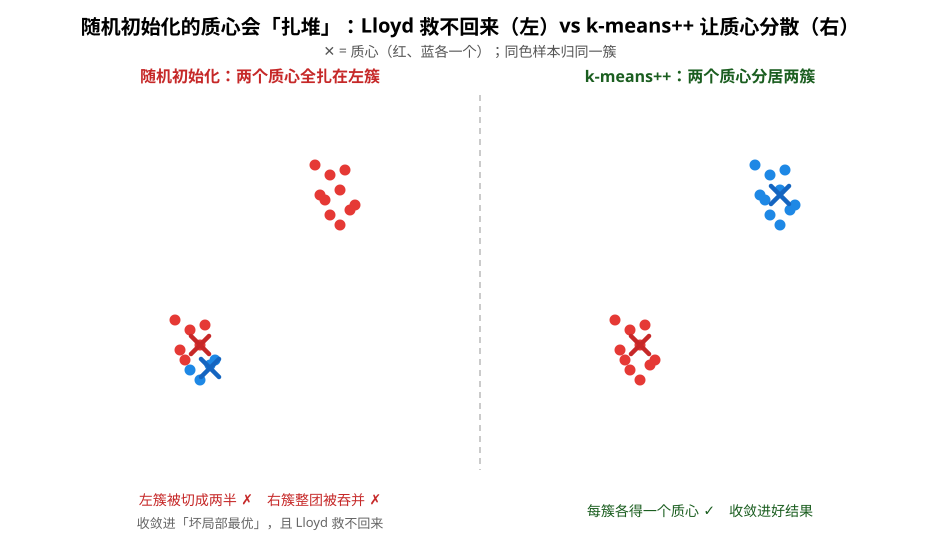
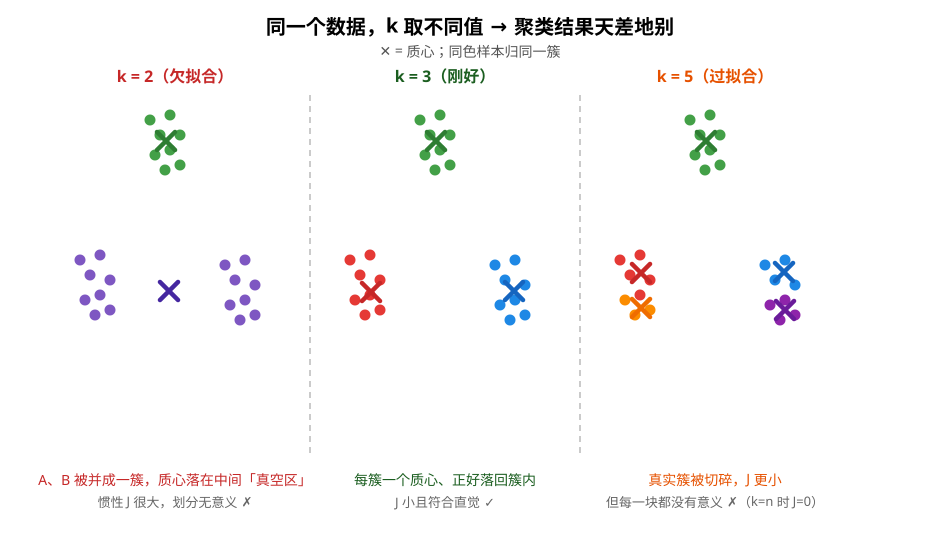

# K 均值聚类（K-Means）原理

> 对应代码：`include/mini_mlmath/ml/kmeans.h`（骨架期，核心算法待你实现）
> 配套测试：`tests/kmeans_test.cpp`
> 前置阅读：[KNN](knn.md)（和监督学习的对照）

如果 KNN 是机器学习里「最懒」的算法，那 k-means 就是**最朴素的无监督算法**：**给定一批没有标签的点，把它们自动分成 k 坨，每一坨用它的「平均位置」代表。** 它不预测「这个样本是猫还是狗」——因为没有标签可以学；它回答的是「这些样本天然聚成几群、每一群的典型长相是什么」。

```
输入：n 个没有标签的样本 {x_1, ..., x_n}，外加你指定的簇数 k
输出：k 个簇心 {c_1, ..., c_k}，以及每个样本被分到了哪个簇
```

k-means 和 KNN 只有一字之差，但本质是两个世界：KNN 是**监督**（要标签）、**懒学习**（fit 只存数据）；k-means 是**无监督**（不要标签）、**勤学习**（fit 真的在迭代算东西）。记住这对照，学起来不串味。

> **本文的两个重点问题**：① 初始质心会「扎堆」→ 收敛进坏局部最优（§3）；② k 的取值直接改变结果，k 太小/太大都无意义（§6）。读完能复述这两个坑 + 各自的治理办法，就算把 k-means 学明白了。

## 1. 聚类到底在优化什么：总惯性（WCSS）

k-means 不是「凭感觉分堆」，它有一个明确的目标函数。给定 k 个簇心 `c_1..c_k`，定义**总惯性（total inertia，也叫 WCSS / within-cluster sum of squares / SSE）**：

```
J(c_1..c_k) = Σ_{i=1}^{n} min_j ||x_i - c_j||²
```

拆开读：对每个样本 `x_i`，看它离**最近的**那个簇心有多远（`min_j`），把这个距离平方，再把所有样本加起来。直觉一句话：**让每个样本「离它所在一簇的代表」尽量近。** 一个簇里的点越挤成一团，它的贡献越小，J 越小；J 越小 = 聚类越好。

注意平方：距离远 2 倍的样本，代价变成 4 倍。所以 k-means 特别不能容忍「离群点」——一个飞出去的样本会把整个簇心往它那边拽。

**k-means 做的事就是：找一组簇心，把 J 最小化。** 接下来的一切（迭代、初始化、n_init）都在为这个目标服务。

## 2. Lloyd 算法：交替分配与更新

直接对 J 求全局最优解是 NP 难的（k 和 d 稍微大点就无解）。但 J 有一个漂亮的性质，催生了经典的 **Lloyd 算法**（1957，也是今天 sklearn 的 `algorithm='lloyd'`）：

```
1) 初始化：挑 k 个初始簇心（怎么挑，见 §3）
2) 循环：
   ① 分配步  每个样本归到离它最近的簇心
   ② 更新步  每个簇心 = 该簇所有样本的算术平均
   ③ 收敛判断  簇心（或惯性）几乎不动了就停
3) 输出：最终的簇心 + 每个样本的归属
```

每轮循环只做两件超级简单的事：**先认亲（分配），再重新选代表（更新）**。为什么平均是「正确的代表」？这是整个算法唯一需要动脑的地方：

> 给定一个簇 S，求让 `Σ_{x∈S} ||x - c||²` 最小的 c。对 c 求导令其为零：
> `d/dc Σ(x-c)² = Σ -2(x-c) = 0  ⟹  c = (1/|S|) Σ x`，正好是算术平均。

「平方距离 ↔ 均值」是天生一对。这也解释了为什么**换距离必须连「中心取什么」一起换**：L1 距离配的是中位数，余弦距离配的是单位化后的均值——拿均值去配别的距离，数学上就不自洽了。本库的 k-means 因此固定欧氏距离 + 算术平均（KNN 的距离度量可以随意换，这里不能，这是两者设计上的一个区别）。

### 为什么它一定收敛？

两个步骤都不会让 J 变大：分配步里每个样本去了**最近**的簇心（不可能更远），更新步里均值是**最优**代表（不可能更散）。所以 J 单调不增、又有下界（≥0），必然收敛。**但收敛到的是局部最优，不是全局最优**——初始簇心不同，可能收敛进不同的「坑」。这正是 §3 的初始化策略和 §4 的 n_init 存在的理由。

## 3. 重点问题①：随机初始化质心会「扎堆」

**这是 k-means 最容易翻车的第一件事，而且它藏在你看不见的 fit 第一步里。** `detail::init::RandomInit` 是从样本里均匀**不放回**地抽 k 个当初始质心——听起来很公平，但**均匀 ≠ 分散**。运气差时（比如数据本来分两簇、k=2），随机抽出的两个质心可能**都落在同一个簇里**：



左半边就是坏结果：两个质心全扎在左簇。Lloyd 迭代从这里出发会发生什么？

- **左簇被切成两半**：它离两个质心都近，被两个质心瓜分；
- **右簇整团被吞并**：右簇离两个质心都远，但总得挑一个「最近的」归过去——于是整团并入其中一个质心；
- **更新步救不回来**：更新只是「簇内取平均」，质心只能在左簇里微调，**永远无法跨过两簇之间的空区跳到右簇**。

于是算法平静地收敛进一个「左簇劈两半、右簇被并」的**坏局部最优**——J 不小，聚类毫无意义。这不是 Lloyd 的 bug，是初始化埋的雷。关键在 §2 那句「J 单调不增」：**Lloyd 只会从起点一路往下走，绝不会「爬出当前这个坑、换个坑重来」**——初始质心落在哪，基本就决定了你收敛进哪个局部最优。

治理手段有两层：**治本 → 换初始化策略（§3.1）；治标 → n_init 多起点（§4，多跑几遍取 J 最小的那遍，专治「偶尔扎堆」）。**

### 3.1 治本：初始化策略（k-means++ 让质心「撒得开」）

k-means++ 的核心就是**故意不让质心扎堆**——每挑一个新质心，都按「离已选质心越远越容易被选中」的概率抽样：

```
1) 均匀随机抽第一个质心 c_1
2) 对每个样本 x：记 D(x) = 到最近一个已选质心的距离，算 D(x)²
3) 按权重 D(x)² / ΣD(x)² 抽样下一个质心   ← 离已选质心越远，越容易被选成新质心
4) 重复 2)~3) 直到凑满 k 个
```

`D(x)²` 的平方是精髓：已选质心附近的点概率被压得很低，**逼着新质心往没被覆盖的区域放**。代价是每个新质心都要扫一遍全部样本（O(k²·n·d)），换来的是初始质心彼此离得远、Lloyd 收敛进好局部最优的概率大幅提升。实践里 k-means++ 几乎总是更优，所以它是 sklearn 和本库的默认。

`kmeans.h` 里 `RandomInit` 已实现（Fisher-Yates 不放回抽样），`KMeansPlusPlus` 仍是骨架（抛 `std::logic_error`）；接口已定好，**换策略只改一个模板实参**：

```cpp
KMeans<float, detail::init::RandomInit> km_rand(3);        // 随机（可能扎堆，教学用）
KMeans<float, detail::init::KMeansPlusPlus> km_pp(3);      // k-means++（默认，防扎堆）
```

## 4. n_init：多起点「广撒网」

初始化再好也是随机，一次没跑好怎么办？朴素而有效的办法：**多跑几遍，挑最好的。**

```
n_init 遍：
  每遍独立随机初始化 → Lloyd 迭代 → 记录惯性 J
取 J 最小的那遍当最终结果
```

sklearn 默认 `n_init=10`。原理一句话：每次随机初始化是独立事件，跑 10 遍「至少有一遍落在好局部最优」的概率远大于只跑一遍。这是对付「局部最优 ≠ 全局最优」最直接的工程手段，几乎零成本（10 遍就是 10 倍的 O(max_iter·n·k·d)，但数据量不大时无所谓）。

## 5. 结果长什么样、怎么看

训练完你会得到：

- **簇心矩阵** `centers()`（k × d）：每簇的代表点。它是「这簇的典型样本长什么样」——聚类最常用的产出，比如用户分群后拿每个群的中心描述「这群人的典型画像」。
- **每个样本的归属** `labels()` / `predict()`：0..k-1 的簇号。**注意簇号是任意排列的**——这次训练「簇 0 在左边」、下次可能「簇 0 在右边」，因为随机初始化让哪簇先出现是不确定的。所以判断聚类好坏不能对号入座，要看「同一组的样本是否真聚在一起」（本库测试就是这么核对的）。
- **惯性** `inertia()`：训练完的 J 值。越小 = 簇越紧凑。它是**同一 k 下**比较初始化/迭代好坏的标尺，但不能直接跨 k 比较（k 越大 J 越小，见 §6 的肘部法）。

## 6. 重点问题②：k 的取值直接决定结果

**这是 k-means 最容易翻车的第二件事：k 必须由你提前给定，而它直接改变聚类结果。** 同一个数据，k 不同，出来的划分天差地别：



- **k 太小（欠拟合）**：真实的两个簇被**并成一簇**，质心落在两簇之间的**真空区**——那里一个样本都没有。J 很大，结果没意义。
- **k 合适**：每个真实簇一个质心，质心正好落回簇内，J 小且划分符合直觉。
- **k 太大（过拟合）**：一个真实簇被**切碎成几块**，每块独占一个质心。J 更小（簇多了当然紧凑），但每一块都没有意义。

这里的坑在于：**J 随 k 单调不增是必然的**——簇越多，每个样本离自己最近的质心越近。极端情况 k = 样本数 n 时 J = 0（每个样本自己一簇）。所以 **「J 够不够小」根本不能用来选 k**：它只会告诉你「多分几簇总能更紧凑」，永远支持「更大的 k」。

既然不能看 J 的绝对值，就看它**随 k 减得多快**：

### 6.1 肘部法（elbow method）

k 从 3 加到 4，把一大簇硬切成两半，J 掉一大截；k 从 9 加到 10，只是把已经很碎的簇再抠一块，J 几乎不掉。画「k vs J」曲线，找一个「弯折变平」的拐点：

```
惯性
  |                            ________
  |                     _____/
  |                ___/
  |          ____/
  |    _____/
  |____/                  ← 拐点（肘）在此，k 再大收益骤减
  +---+---+---+---+--
      1   2   3   4   5  k
```

拐点就是「加一簇性价比最高」的位置：它左边加簇收益大（k 太小），右边加簇收益小（k 太大）。注意**肘部法没有标准答案**——拐点模糊时，结合业务/领域知识一起定。

### 6.2 轮廓系数（silhouette）

更客观的指标：对每个样本算「到同簇其它样本的平均距离 a（想小）」和「到最近异簇的平均距离 b（想大）」，得 `s = (b - a) / max(a, b)` ∈ [-1, 1]。所有样本的 s 取平均，越接近 1 表示「又紧又分得开」。把每个候选 k 都算一遍轮廓系数，取最高的那个。它比肘部法严谨，但 O(n²) 较贵，样本多时不划算。

## 7. 局限（务必记住）

- **k 要先给**：k 的取值直接改变结果（§6 重点问题②），而它没有免费午餐可自动定，只能肘部法/轮廓系数/先验知识。
- **只能找「球形」簇**：J 用的欧氏平方，隐式假设簇是「各向同性的球」。长条、月牙、嵌套的簇它会切错——那是 DBSCAN / 谱聚类的主场。
- **对尺度敏感**：和 KNN 一样，量纲大的特征会淹没其他特征，**用前必须特征缩放**（z-score / min-max）。
- **对离群点敏感**：平方项把离群点放大，一个飞点能把簇心拽歪（均值不是稳健统计量，中位数才是）。
- **局部最优**：质心扎堆（§3 重点问题①）是主因；n_init + k-means++ 只能降低概率，不能消除（这也是后面要学 GMM / EM 的原因之一）。

## 8. 和 KNN 的对照（本库最好的记忆锚点）

| | KNN（监督）| K-means（无监督）|
|---|---|---|
| 要标签吗 | 要 | **不要** |
| fit 干什么 | 懒：只存数据 | 勤：迭代算簇心 |
| fit 复杂度 | O(1) | O(n_init·max_iter·n·k·d) |
| 模型长什么样 | 训练数据本身 | k 个簇心 |
| 距离度量 | 可随意换（扩展点）| 固定欧氏（要和均值配套）|
| 预测时 | 找 k 个近邻投票 | 找最近簇心 |
| 主要坑 | 高维诅咒、要缩放 | 要定 k、局部最优、要缩放 |

共同点是**都吃特征缩放**、都靠「距离」说话、都用「离谁近」决策。一个入门监督、一个入门无监督，是对完美的双胞胎教材。

## 9. 扩展路线（实现完骨架后可挑战）

- **KMeansPlusPlus 初始化策略**：`detail::init::KMeansPlusPlus` 目前是骨架，先实现它（`RandomInit` 已完成，`kmeans.h` 里注释给了思路）。
- **自定义 init**：照 `detail::init` 的签名写新 functor（FarthestFirst、按数据范围均匀撒点……）。
- **自定义度量 + 配套中心**：换 L1 → 中位数、余弦 → 单位化均值，挑战「欧氏配均值」的配套约束。
- **Mini-batch K-Means**：每次只用一小批样本更新簇心，scikit-learn 的 `MiniBatchKMeans`，大数据时代的标配。
- **k-medoids**：簇心必须是「真实样本」而非均值（抗离群点）。
- **GMM / EM**：把「每个样本硬性归一簇」软化成「属于各簇的概率」，k-means 的进化形态。

## 10. 延伸阅读

- [KNN](knn.md)：和监督学习的对照、距离度量大全
- [线性回归](linear_regression.md)：同为「勤学习」，但是有监督
- [自动求导](autograd.md)：GMM / EM 里算梯度 / 收敛判断会用到的工具
