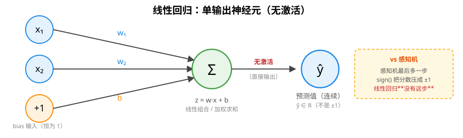
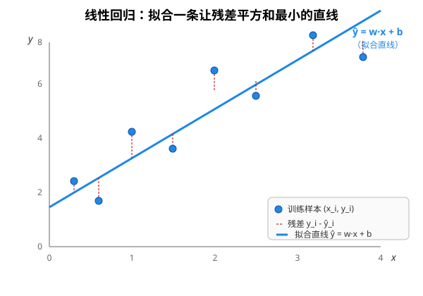
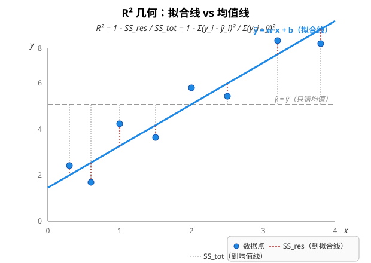

# 线性回归（Linear Regression）原理

> 对应代码：`include/mini_mlmath/ml/linear_regression.h`（骨架，核心算法留 TODO）
> 前置阅读：[感知机原理](perceptron.md)、[激活函数](activation.md)

线性回归是**最朴素的监督学习模型**：把目标 y 当成特征的**线性组合**。模型形式 `f(x) = w·x + b` 几乎和感知机一模一样（都是「加权求和 + 偏置」），区别只在一个字：**回归预测连续值**（房价、温度、销量），**分类预测离散标签**（+1/-1）。整个 Ridge / Lasso / ElasticNet / 逻辑回归家族，全是在它的损失函数上「加正则」或「换 link function」，把这一个啃透，后面只是「在同一个损失上加东西」。

## 1. 结构



和感知机对比就清楚了：结构是**同一个神经元**，但**拿掉了 sign 激活**，直接输出连续值 ŷ。

## 2. 数学定义

```
模型（预测函数）:    ŷ = w · x + b = w₁x₁ + w₂x₂ + ... + w_d x_d + b
损失（MSE / SSE）:  L = (1/n) Σ_i ( ŷ_i - y_i )²
```

- `w = (w₁, ..., w_d)`：每个特征的权重
- `b`：偏置（bias），让拟合直线可以不过原点 —— **必需**（详见 [感知机](perceptron.md) 那篇为什么 AND 都学不出来）
- **没有激活函数**：感知机的最后一步是 `sign(z)` 把分数压成 ±1；线性回归**直接输出分数**，因为我们要的就是「连续值预测」

**几何含义**（以 d=2 为例）：`ŷ = w₁x₁ + w₂x₂ + b` 在 (x₁, x₂, ŷ) 三维空间里是一个**平面**；投影到二维特征空间上就是一条**直线**。线性回归学的就是「穿过数据点云中心、让所有点到它的竖直距离平方和最小」的那条线：



## 3. 闭式解：正规方程（normal equation）

把损失 L 对 w、b 求导、令导数 = 0，就能直接写出解 —— **不用迭代，一步到位**。

用 bias folding 把 b 并入权重（详见 §5），记 `X̃` = X 右边拼一列 1、`w̃` = (w; b)，正规方程是：

```
w̃ = (X̃ᵀ · X̃)⁻¹ · X̃ᵀ · y        (长度 d+1)
```

四个矩阵的形状：`X̃` 是 n×(d+1)，`X̃ᵀ` 是 (d+1)×n，`X̃ᵀ·X̃` 是 (d+1)×(d+1)（小矩阵，求逆代价 O(d³)），最终 `w̃` 是 (d+1)×1。

**优点**：理论上一步到位，不需要调学习率 / 迭代次数这些超参。

**缺点**：
- 求逆是 O(d³)，d 很大（>10000）时慢
- `XᵀX` 可能接近奇异（特征高度相关时），数值不稳定。真实工程里**用 SVD 解最小二乘**更稳（sklearn 的 `LinearRegression` 内部就是用 `np.linalg.lstsq` 走 SVD）

## 4. 数值解：梯度下降

正规方程是「闭式解」，梯度下降是「数值解」，各有所长。

```
随机初始化 w̃
重复 N 轮：
    ŷ = X̃ · w̃                              // 前向：算预测
    ∂L/∂w̃ = (2/n) · X̃ᵀ · (ŷ - y)          // 反向：算梯度
    w̃ ← w̃ - lr · ∂L/∂w̃                    // 沿负梯度走一步
```

`lr`（learning rate）是要调的超参；`N`（迭代轮数）也是。损失 L 是**凸函数**（二次型 + 凸集），所以**梯度下降必然收敛到全局最优** —— 不像神经网络那样有局部最小值的烦恼。

**vs 正规方程**：

| | 正规方程 | 梯度下降 |
|---|---|---|
| 复杂度 | O(d³) 解一次 | O(n·d) 每轮，N 轮 |
| 特征数 d 大 | 慢（求逆是瓶颈） | 快 |
| 样本数 n 大 | 慢不了多少 | 慢（每轮要扫全部样本） |
| 加正则（Ridge）| 改一下公式就行 | 改一下公式就行 |
| 学习率 / 迭代数 | 不需要 | 需要调 |
| 工程稳定性 | 特征相关时易爆 | 较稳（加正则） |

**经验法则**：d < 10000 用正规方程，d > 100000 用梯度下降（中间地带看场景）。加了 Ridge / Lasso 之后，梯度下降几乎是必选 —— 因为 L1 正则不可导，必须用近端梯度下降之类的迭代法。

## 5. bias folding（偏置折叠）

`linear_regression.h` 的实现里**始终把 b 并进 w**，靠 `Matrix::with_ones_column()` 把 X 右边拼一列恒 1：

```
x̃ = [x₁, x₂, ..., x_d, 1]     增广样本（多一个恒 1 特征）
w̃ = [w₁, w₂, ..., w_d, b]     增广权重（bias 是最后一个分量）

ŷ = w̃ · x̃                    ← 没有单独的 + b 了
梯度：∂L/∂w̃ = (2/n) X̃ᵀ(X̃w̃ - y)   ← 一条规则覆盖 w 和 b
```

和感知机里讲过的 `bias folding` 是同一招（详见 [感知机原理](perceptron.md) §6.2）。好处是更新 / 求解只剩一条公式、没有特判 —— PyTorch 的 `nn.Linear` 内部也是 `[W | b]` 拼一起存的。

**为什么不用 `fit_intercept=False` 开关？** sklearn 暴露这个开关是因为它面向「统计学传统用户」；本库教学导向，干脆只保留「永远学偏置」一种行为 —— 想强制过原点的话，**自己在外面对 X 中心化**（减去列均值）就行。

## 6. 评指标：R²（决定系数）

R² 是「模型解释掉的方差占总方差的比例」，**最常用的回归评指标**。

```
R² = 1 - SS_res / SS_tot
   = 1 - Σ(y_i - ŷ_i)²  /  Σ(y_i - ȳ)²

  SS_res = 残差平方和（Residual Sum of Squares）  ← 模型没解释掉的部分
  SS_tot = 总平方和（Total Sum of Squares）        ← 和「猜均值 ȳ」比
```



**几何直觉**：
- `SS_tot`：每个点相对「均值水平线 `ŷ = ȳ`」的竖直距离平方和 —— 等于「啥也不学、只猜均值」的误差
- `SS_res`：每个点相对「拟合直线」的竖直距离平方和 —— 等于「学了模型」之后的误差
- 拟合得越好 → SS_res 越小 → R² 越接近 1

**取值范围**：
- R² = 1：完美拟合（所有点都在拟合线上）
- R² = 0：模型和「猜均值」一样烂
- R² < 0：模型**比猜均值还差**（通常意味着模型没学到信号，或用错了）

## 7. 和感知机的对照

它们**模型结构完全一样**（`ŷ = w·x + b`），区别只在「预测什么」和「怎么学」：

| | 感知机 | 线性回归 |
|---|---|---|
| 模型 | `ŷ = sign(w·x + b)` | `ŷ = w·x + b`（无激活）|
| 输出 | ±1 离散 | 连续值 |
| 损失 | 0（错了才更新）| MSE（残差平方）|
| 更新 | 只看对错 | 看误差大小 |
| 收敛 | 线性可分时收敛 | 永远收敛到全局最优（凸）|
| 学不到时 | 权重震荡 | 给差的数据时 R² < 0 |

**这条对照链是 ML 入门最值得记的一张表** —— 同一族模型，**「输出 + 损失 + 更新」三件套一变，就从分类变成回归**。逻辑回归就是再变一次（输出换 sigmoid 把连续分数压成概率，损失换成交叉熵）。

## 8. 局限与扩展

**局限**：
- **只能拟合线性关系**：真实世界的关系（房价 vs 面积）经常不是直线，需要多项式回归、样条、或者换成更复杂的模型
- **对异常值敏感**：MSE 是平方误差，单个离群点会拉爆损失 → 实践中常用 Huber 损失（小区间 MSE + 大区间 MAE）做鲁棒回归
- **特征共线性时不稳定**：XᵀX 接近奇异，求逆会放大噪声 → 这正是 **Ridge 正则**（加 λI）要解决的问题

**扩展路线**（都是「在同一个损失上加东西」）：
- **Ridge 回归**：损失加 `λ·||w||²`，让 XᵀX 加上 λI 后必可逆，缓解共线性
- **Lasso 回归**：损失加 `λ·||w||₁`，倾向于把不重要的权重**正好压到 0**，自带特征选择
- **ElasticNet**：Ridge + Lasso 组合
- **多项式回归**：把 x 替换成 [x, x², x³, ...]，模型本身还是线性的 —— 但能拟合曲线
- **逻辑回归**：换成 sigmoid 输出 + 交叉熵损失，得到可导的线性分类器

## 9. 和本库代码的对应

### `ml/linear_regression.h` 的接口设计

```cpp
LinearRegression<> lr;                  // 默认 T=float（GPU 友好、内存省）
// LinearRegression<double> lr;         // 想要 double 精度时显式指定
lr.fit(X, y);                           // X: n×d 样本，y: n 个连续值
auto pred  = lr.predict(X_test);        // 返回连续预测值 ŷ
T r2       = lr.score(X_test, y_test);  // 返回 R² ∈ (-∞, 1]，1 表示完美
auto w     = lr.weights();              // std::vector<T>，长度 d
T b        = lr.bias();                 // 标量
```

API 形状照搬 sklearn 的 `LinearRegression`（`fit` / `predict` / `score`），但内部成员命名走项目自己的 `weights` / `bias` 风格（和 `Perceptron` 一致）—— 文件头注释里有 `lr.weights() ↔ sklearn: lr.coef_` 的对应表。

T 必须是浮点类型（`float` / `double` / `long double`），用类内 `static_assert` 拦在编译期 —— int 矩阵没法做浮点除法（解正规方程时），int 累加也会在梯度里溢出。

### 核心算法留 TODO

`fit` / `predict` / `score` 三个函数的数学计算部分是**空骨架**（函数体里 `Matrix<T> w_aug;` 那一行就是占位的），留给实现者写：
- `fit`：二选一 —— 正规方程（手写高斯消元解 `Aw = b`，推荐）或梯度下降（更通用，便于以后加 Ridge / Lasso）
- `predict`：bias folding 一次矩阵乘（参考 `perceptron.h` 里的 `decision_function` 写法）
- `score`：先 predict 拿 ŷ，再两遍循环算 SSE 和 ȳ / SST，套公式

## 10. 延伸阅读

- [感知机原理](perceptron.md)：同一个 `w·x + b` 结构，分类版本
- [激活函数](activation.md)：sigmoid / ReLU —— 逻辑回归就是在 LR 上套个 sigmoid
- 正规方程的数值稳定性：用 SVD 替代 `(XᵀX)⁻¹Xᵀy`（`numpy.linalg.lstsq` 内部就是这么干）
- Ridge / Lasso：把 L2 / L1 正则加到 MSE 损失上
- 多项式回归：x 替换成 [x, x², x³] 后模型仍是「线性」的（对参数线性）
