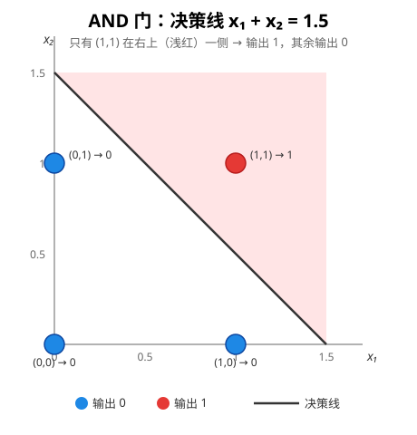
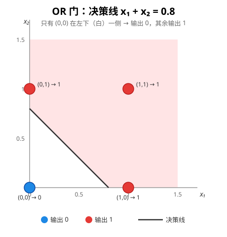
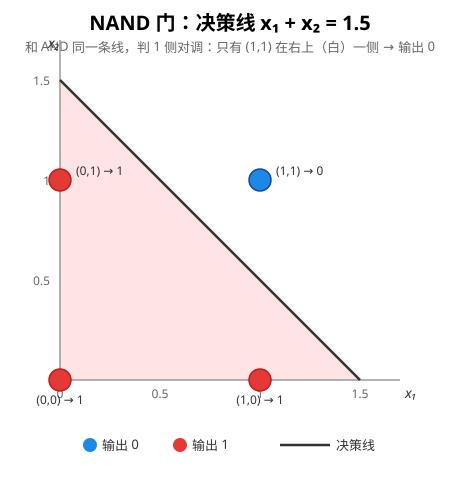
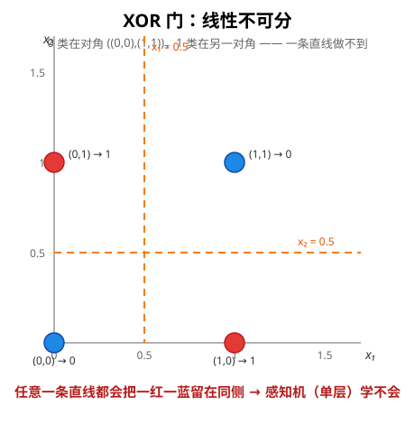

# 逻辑门与决策边界：AND / OR / NAND

> 对应代码：`tests/logic_gate.cpp`
> 前置阅读：[感知机原理](perceptron.md)

逻辑门是感知机最经典的入门实验（《统计学习方法》例 2.1 就是 AND 门）：输入两个 0/1 值，输出 0 或 1。本节做三件事：

1. 三个门（AND / OR / NAND）的真值表和几何直觉
2. **用数学推出权重**——它们不是试出来的，是把真值表写成不等式组解出来的
3. XOR 为什么学不会（线性不可分），以及多层网络为什么能解决

## 1. 感知机怎么表示逻辑门

感知机输出 `sign(w₁x₁ + w₂x₂ + b)`，决策面是直线 `w₁x₁ + w₂x₂ + b = 0`。逻辑门问题 = **在四个点上画一条直线，把输出 0 和输出 1 的点分开**。

代码里用 bias folding 实现（`with_ones_column()` 增广 + 一次矩阵乘），权重向量第三个分量就是 bias：

```cpp
const Matrix<float> feature = dataset.with_ones_column(); // n×3: [x1, x2, 1]
const Matrix<float> weight({{0.5f, 0.5f, -0.75f}});       // 1×3，第三分量 = bias
const Matrix<float> scores = feature * weight.transposed(); // n×1
```

## 2. AND 门

| x₁ | x₂ | AND |
|---|---|---|
| 0 | 0 | 0 |
| 0 | 1 | 0 |
| 1 | 0 | 0 |
| 1 | 1 | **1** |



只有 (1,1) 输出 1，其余输出 0。四个点中 0 类聚在左下三角、1 类在右上角，**一条直线能分开**。

### 权重推导（不等式组法）

把真值表代入 `z = w₁x₁ + w₂x₂ + b`，`z > 0` 判 1：

```
(0,0)→0:   b ≤ 0
(0,1)→0:   w₂ + b ≤ 0
(1,0)→0:   w₁ + b ≤ 0
(1,1)→1:   w₁ + w₂ + b > 0
```

AND 对 x₁、x₂ 对称，取 `w₁ = w₂ = w`（对称性简化），整理得：

```
b ≤ 0,  w + b ≤ 0,  2w + b > 0
⟹  -b/2 < w ≤ -b        （b ≤ 0）
```

这是**区间解**，区间内任意值都合法。取 `b = -1.5` 得 `0.75 < w ≤ 1.5`，取 `w = 1`：

```
w = (1, 1),  b = -1.5      决策线 x₁ + x₂ = 1.5
```

代码里用的 `(0.5, 0.5, -0.75)` 是它的 0.5 倍缩放——**同一条决策线**（整体乘正数，符号不变）。

### 直觉版推导（心算）

AND 只在 `x₁ + x₂ = 2` 时输出 1，所以判断"x₁ + x₂ 是否 > 1.5"即可。阈值 1.5 落在 1 和 2 之间——直接给出 `w=(1,1), b=-1.5`。

## 3. OR 门

| x₁ | x₂ | OR |
|---|---|---|
| 0 | 0 | 0 |
| 0 | 1 | **1** |
| 1 | 0 | **1** |
| 1 | 1 | **1** |



只有 (0,0) 输出 0，其余输出 1。

### 权重推导

```
(0,0)→0:   b ≤ 0
(0,1)→1:   w₂ + b > 0
(1,0)→1:   w₁ + b > 0
(1,1)→1:   w₁ + w₂ + b > 0     （自动满足）
```

对称性取 `w₁ = w₂ = w`：`w > -b` 且 `b ≤ 0`。取 `b = -0.5` 得 `w > 0.5`，取 `w = 1`：

```
w = (1, 1),  b = -0.5      决策线 x₁ + x₂ = 0.5
```

代码里用的 `(0.5, 0.5, -0.4)`：`w = 0.5 > -b = 0.4` ✓，决策线 `x₁ + x₂ = 0.8`，在 0 和 1 之间，合法。

## 4. NAND 门

| x₁ | x₂ | NAND |
|---|---|---|
| 0 | 0 | **1** |
| 0 | 1 | **1** |
| 1 | 0 | **1** |
| 1 | 1 | 0 |



NAND = NOT AND，输出恰好反过来：只有 (1,1) 输出 0。

### 权重推导

```
(0,0)→1:   b > 0
(0,1)→1:   w₂ + b > 0
(1,0)→1:   w₁ + b > 0
(1,1)→0:   w₁ + w₂ + b ≤ 0
```

对称性取 `w₁ = w₂ = w`：`-b < w ≤ -b/2` 且 `b > 0`。取 `b = 1.5` 得 `-1.5 < w ≤ -0.75`，取 `w = -1`：

```
w = (-1, -1),  b = 1.5      决策线 x₁ + x₂ = 1.5（同 AND，方向相反）
```

代码里用的 `(-1, -1, 1.1)`：`-1.1 < -1 ≤ -0.55` ✓。

**注意**：NAND 的决策线和 AND 是**同一条**（`x₁ + x₂ = 1.5`），区别只是把哪一侧判 1 对调了——用负权重实现。这也解释了为什么 AND/NAND 参数互为相反数。

## 5. 通用方法总结

权重推导三步走，**从此不用瞎猜**：

1. **代入真值表**：每行得一个线性不等式 `w·x + b > 0`（或 ≤ 0）
2. **对称性降维**：输入对称时取 `w₁ = w₂ = w`
3. **解区间**：得到 `w` 和 `b` 的约束区间，区间内任意取

| 门 | 约束 | 一个解 | 代码里的解 |
|---|---|---|---|
| AND | `-b/2 < w ≤ -b` | (1, 1, -1.5) | (0.5, 0.5, -0.75) |
| OR | `w > -b` | (1, 1, -0.5) | (0.5, 0.5, -0.4) |
| NAND | `-b < w ≤ -b/2` | (-1, -1, 1.5) | (-1, -1, 1.1) |

解不唯一（缩放自由度）：整体乘正数，决策线不变。**"试出来"的权重其实都落在这些区间里**——因为感知机只要求可分，不求唯一。

## 6. XOR：为什么单层学不会

| x₁ | x₂ | XOR |
|---|---|---|
| 0 | 0 | 0 |
| 0 | 1 | **1** |
| 1 | 0 | **1** |
| 1 | 1 | 0 |



0 类在对角（(0,0) 和 (1,1)），1 类在另一对角（(0,1) 和 (1,0)）——**任何一条直线都会把一红一蓝留在同侧**。这就是"线性不可分"。

### 代数证明（不等式组无解）

```
(0,0)→0:   b ≤ 0
(0,1)→1:   w₂ + b > 0
(1,0)→1:   w₁ + b > 0
(1,1)→0:   w₁ + w₂ + b ≤ 0
```

中间两式相加：`w₁ + w₂ + 2b > 0`；代入第四式（`w₁ + w₂ ≤ -b`）得：

```
-b + 2b > 0  ⟹  b > 0
```

与第一式 `b ≤ 0` **矛盾**。不等式组无解——不存在任何 (w₁, w₂, b) 能分对 XOR。这就是"线性不可分"的严格定义，也是感知机收敛定理（前提是线性可分）失效、训练震荡不收敛的原因。

### 解法：加隐藏层

XOR = (x₁ OR x₂) AND NAND(x₁, x₂)：

```
x ──▶ 隐藏层：[OR 神经元, NAND 神经元] ──▶ 输出层 AND ──▶ ŷ
```

隐藏层把四个点映射成 `(or, nand)`：0 类变 (0,1)/(1,0)、1 类变 (1,1)——**非线性地掰到可分的位置**，输出层一条直线就能分了。这正是多层感知机（MLP）的核心思想，也是下一课的内容。
