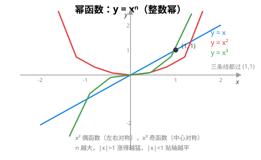
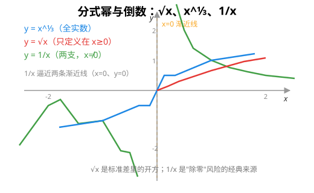
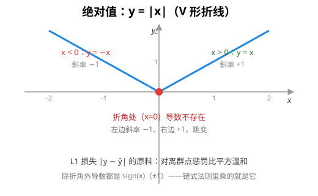
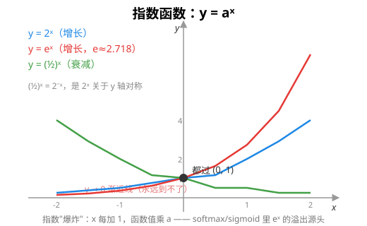
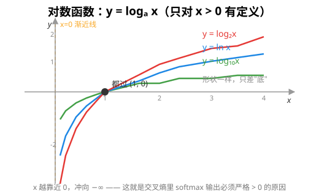
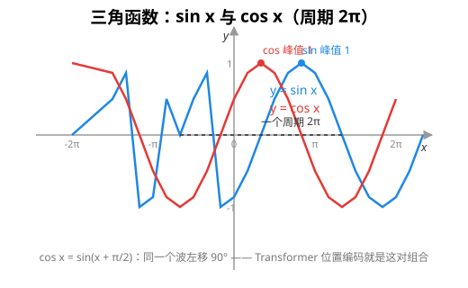
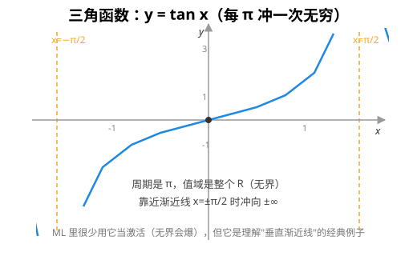

# 常见数学函数与图像：一份看得懂的速查

> 前置阅读：无。本文假设你"看到函数式就想不起来它长什么样"。
> 衔接阅读：[链式法则](chain_rule.md)（每张图都配了导数）、[激活函数](activation.md)、[Softmax](softmax.md)

机器学习里到处是函数：激活函数、损失函数、softmax、指数、对数……本文把最常见的一族函数——**幂函数、绝对值、指数函数、对数函数、三角函数**——每类配一张图 + 一个表格，讲清"图像长什么样、为什么、以及它在 ML 里用在哪"。看懂了这张图上的函数，你再看 `activation.h`、`softmax.h` 里的代码就不会觉得它们是黑盒了。

## 1. 一张函数图要读什么

拿到任意函数 `y = f(x)`，看图就抓这四件事：

```
① 定义域    x 能取哪些值？（开方要 x≥0，对数要 x>0，分母不能为 0）
② 值域      y 能到哪些值？（平方≥0，指数>0）
③ 单调性    往右走是升还是降？在哪儿拐弯？
④ 特殊点    和坐标轴的交点、(0,1)/(1,0) 这类标志点、渐近线
```

这四件事一清，函数在脑子里就"活"了。下面每张图都标了它们。

## 2. 幂函数：`y = xⁿ`

幂函数一族长得差别很大，全看指数 n。核心三条曲线记住就够：



| 函数 | 图像特征 | 定义域 / 值域 | ML 里在哪 |
|---|---|---|---|
| `y = x` | 一条 45° 直线 | R / R | 恒等映射、残差连接（ResNet 的 `y = x + F(x)` 里那个 x） |
| `y = x²` | 开口向上的抛物线 | R / [0,∞) | **L2 损失** `(y−ŷ)²`、欧氏距离 |
| `y = x³` | 穿过原点的"S 形"，两边压得比直线狠 | R / R | 一些激活变体、矩（skewness 偏度） |

规律：**指数是偶数 → 关于 y 轴对称（偶函数）；指数是奇数 → 关于原点对称（奇函数）**。n 越大，曲线在 `|x|>1` 时涨得越猛、在 `|x|<1` 时贴 x 轴越平。

### 分式幂和倒数：`x^½`、`x^⅓`、`1/x`



| 函数 | 图像特征 | 定义域 / 值域 | ML 里在哪 |
|---|---|---|---|
| `y = x^½`（√x） | 平缓上升的弧线，只在 x≥0 | [0,∞) / [0,∞) | **标准差** `√方差`（`random.h`、`statistics.h` 内部） |
| `y = x^⅓` | 经过原点的 S 形，比 x³ 平缓 | R / R | 数据的幂变换（让分布更对称） |
| `y = 1/x` | 两支双曲线，逼近两条渐近线 | x≠0 / y≠0 | **倒数归一化**、调和平均 |

倒数函数有两个必须记住的点：**定义域排除 x=0**（除零），而且它趋向 0 的速度很慢——这就是为什么很多归一化手段宁可用 `1/(1+x)` 也不用 `1/x`。

## 3. 绝对值：`y = |x|`



```
y = |x| =  x    如果 x ≥ 0
          −x    如果 x < 0
```

- **V 形折线**：在 x=0 处有个折角——这是它和前面所有光滑函数最大的区别：**折角处导数不存在**（左边斜率 −1，右边斜率 +1）。
- 定义域 R，值域 [0,∞)。偶函数（关于 y 轴对称）。

ML 里它是 **L1 损失/MAE** 的原料 `|y − ŷ|`：不像 L2 对离群点惩罚得那么狠（差的平方会把大误差放大）。链式法则里它的导数（x≠0 处）是符号函数 `sign(x)`。

## 4. 指数函数：`y = aˣ`

指数函数是"**增长之王**"：自变量每加 1，函数值乘以固定倍数 a。



| 函数 | 图像特征 | 定义域 / 值域 | ML 里在哪 |
|---|---|---|---|
| `y = 2ˣ` | 陡峭上升，穿过 (0,1) | R / (0,∞) | 位运算、复杂度直觉 |
| `y = eˣ` | 上升更缓一点（e≈2.718） | R / (0,∞) | **softmax / sigmoid 的原料**、连续复利 |
| `y = (1/2)ˣ` | 和 2ˣ 关于 y 轴对称，**递减** | R / (0,∞) | 衰减、半衰期 |

三个必须记住的图直觉：

1. **所有指数都过 (0, 1)**：`a⁰ = 1`。
2. **x 越往负，曲线贴着 y=0 逼近但永远到不了**——这就是"**指数爆炸**"和它的镜像"**指数衰减**"。softmax 里 `exp(1000)` 直接溢出成 `inf`（见 [Softmax](softmax.md) 的数值稳定性），根源就在这里。
3. `(1/2)ˣ = 2⁻ˣ`，就是 2ˣ 的镜像——**底数小于 1 就是递减**。

> 底数 `a>1` 时 `aˣ` 是增长，`0<a<1` 时是衰减。深度学习里 `e` 最常见（sigmoid/softmax），所以请格外熟悉 `eˣ`。

## 5. 对数函数：`y = log_a x`

对数是指数的"反函数"：指数回答"x 次方是几"，对数回答"几次方是 x"。



| 函数 | 图像特征 | 定义域 / 值域 | ML 里在哪 |
|---|---|---|---|
| `y = ln x` | 穿过 (1,0) 的平缓上升曲线 | (0,∞) / R | **交叉熵损失 `−log`**、信息熵、逻辑回归 |
| `y = log₂ x` | 同形状，涨得更慢一点（2 倍刻度） | (0,∞) / R | 信息论（bit）、决策树信息增益 |
| `y = log₁₀ x` | 同形状，最平缓 | (0,∞) / R | 数量级、pH 值、地震震级 |

三个关键直觉：

1. **定义域是 x > 0**——对数接受不了 0 或负数。这就是交叉熵里 `softmax` 输出严格 >0 才"log-safe"的原因（见 [Softmax](softmax.md)）。
2. **都过 (1, 0)**：`log_a 1 = 0`。
3. **x 往 0 靠时，曲线冲向 −∞**（垂直渐近线 x=0）。

对数和指数**互为反函数**：`log_a(aˣ) = x`，`a^(log_a x) = x`。图上就是"关于 y=x 对称"。机器学习里最常见的是 `ln`（自然对数）和 `log₂`（信息论），`log₁₀` 基本只在工程尺度感上用。

## 6. 三角函数：`sin x`、`cos x`、`tan x`

三角函数是**周期函数**——图像会不断重复自己。



| 函数 | 图像特征 | 定义域 / 值域 | ML 里在哪 |
|---|---|---|---|
| `y = sin x` | 波浪，周期 2π，最大 1 最小 −1 | R / [−1,1] | 正弦位置编码（Transformer 的 `PE` 就是 sin/cos） |
| `y = cos x` | 和 sin 同形，**整体左移 π/2** | R / [−1,1] | 同上（偶函数） |
| `y = tan x` | 一波一波冲向 ±∞，周期 π | x≠π/2+kπ | 不太用于神经网络，但理解它=理解"无界+垂直渐近线" |



四个要点：

1. **振幅 1、周期 2π**：函数值在 −1 和 1 之间来回摆，永远不会超界——这给了 sin/cos 当"稳定振荡"用处的底气。
2. **`cos x = sin(x + π/2)`**：同一个波，相位差 90°。所以 Transformer 的位置编码经常写 `sin(pos/10000^{2i/d})` 和 `cos(pos/10000^{2i/d})` 成对出现——它们覆盖不同相位。
3. **tan 每 π 冲一次无穷**：它有垂直渐近线（x=π/2 等），值域是整个 R。ML 里基本不用它当激活（无界会爆），但它是理解"垂直渐近线"的经典例子。
4. 它们都是**光滑周期函数**，导数也很好记（见下节表格）。

## 7. 速查表：图像、定义域、导数一把抓

下表把上面所有函数收在一起（**导数那一列就是 [链式法则](chain_rule.md) 里反向传播乘的"局部导数"**）：

| 函数 | 定义域 | 值域 | 单调性 | 导数 |
|---|---|---|---|---|
| `x` | R | R | 恒增 | `1` |
| `x²` | R | [0,∞) | x<0 减 / x>0 增 | `2x` |
| `x³` | R | R | 恒增 | `3x²` |
| `√x` | [0,∞) | [0,∞) | 增 | `1/(2√x)` |
| `1/x` | x≠0 | y≠0 | x<0 减 / x>0 减 | `−1/x²` |
| `|x|` | R | [0,∞) | x<0 减 / x>0 增 | `sign(x)`（x≠0） |
| `aˣ` (a>1) | R | (0,∞) | 增 | `aˣ·ln a` |
| `eˣ` | R | (0,∞) | 增 | `eˣ`（导数=自己！） |
| `(1/2)ˣ` | R | (0,∞) | 减 | `(1/2)ˣ·ln(1/2)` |
| `ln x` | (0,∞) | R | 增 | `1/x` |
| `log₂ x` | (0,∞) | R | 增 | `1/(x·ln2)` |
| `log₁₀ x` | (0,∞) | R | 增 | `1/(x·ln10)` |
| `sin x` | R | [−1,1] | 周期振荡 | `cos x` |
| `cos x` | R | [−1,1] | 周期振荡 | `−sin x` |
| `tan x` | x≠π/2+kπ | R | 每段增 | `1/cos²x` |

最值得背的三条（ML 里反复出现）：

```
(eˣ)' = eˣ            指数函数求导不变——softmax/sigmoid 链式法则里全靠它省事
(ln x)' = 1/x         对数把乘法变加法，求导变成倒数
(sin x)' = cos x      三角导数互转，且相位差 π/2
```

## 8. 和本库代码的对应

本库几个头文件其实就是这些函数的"应用"：

| 本库代码 | 用到的函数 | 说明 |
|---|---|---|
| `activation.h` 的 `sigmoid` | `eˣ`、`1/(1+…)` | sigmoid = `1/(1+e⁻ᶻ)`，就是指数函数的组合 |
| `activation.h` 的 `relu` | `max(0,z)`、`|·|` 家族 | ReLU 是"分段线性"，和 `|x|` 同属分段函数族 |
| `softmax.h` 的 `softmax` | `eˣ`、`Σ` | 逐元素 exp + 归一化，指数函数是核心 |
| `statistics.h` | `x²`、`√x` | 方差 = 平方的平均，标准差 = 方差开方 |
| `random.h` | `eˣ`（高斯） | 正态分布密度里就有 `e^(−x²/2)` |
| `autograd.h` / [链式法则](chain_rule.md) | 上表「导数」列 | 反向传播每步乘的就是这些导数 |

看到 `e`、`log`、`sin` 在代码里出现，回到本节的图上认一认——它们全是"长得怎样、怎么求导"都能一眼看穿的函数。

## 9. 自测：读图猜函数

不看上文，看下面三条描述，猜是哪个函数：

1. 偶函数，V 形，x=0 处有折角 ——（ `|x|` ）
2. 穿过 (0,1)，x 越大涨得越快，y 永远为正 ——（ `eˣ` / `2ˣ` ）
3. 只对正数有定义，穿过 (1,0)，x 越小越接近 −∞ ——（ `ln x` / `log₂ x` ）

猜对说明你已经建立了"函数式 ↔ 图像"的连接，这正是读 ML 代码最需要的肌肉记忆。

## 10. 延伸阅读

- [链式法则](chain_rule.md)：本表「导数」列是反向传播的局部导数，链式法则是把它们串起来的规则
- [激活函数](activation.md)：sigmoid（指数函数组合）vs ReLU（分段线性）
- [Softmax](softmax.md)：指数函数的爆炸性 + 减 max 的救法
- [线性回归](linear_regression.md)：L2 损失（x²）和梯度下降
