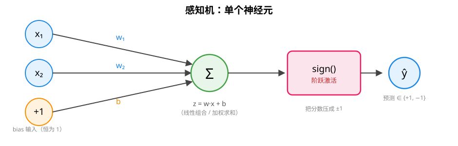

# 感知机（Perceptron）原理

> 对应代码：`include/mini_mlmath/ml/perceptron.h`（骨架，实现待填充）
> 配套实验：`tests/logic_gate.cpp`

感知机是 1958 年 Frank Rosenblatt 提出的**最朴素的线性二分类器**，也是神经网络的"祖宗"：单个神经元 = 加权求和 + 阶跃激活。深度学习里的权重、偏置、激活、梯度更新，全都能在感知机上找到最原始的原型。

## 1. 结构



一个神经元做两件事：

1. **线性组合（加权求和）**：把输入和权重做点积，再加上偏置
2. **阶跃激活**：把分数压成 ±1 两个离散输出

## 2. 数学定义

```
决策函数（线性分数）:   z = w·x + b = w₁x₁ + w₂x₂ + ... + w_d x_d + b
预测输出:               ŷ = sign(z)，取 +1 / -1
```

- `w = (w₁, ..., w_d)`：权重向量，每个特征的重要性
- `b`：偏置（bias），让决策线可以不过原点（**必需**，后面逻辑门会看到没有它 AND 都学不出来）
- `sign`：阶跃函数，`z > 0` 判 +1，否则判 -1

**几何含义**：`z = 0` 是一个（超）平面，感知机就是用这个平面把特征空间切成两半，两侧各一个类别。

## 3. 学习规则（怎么训练）

经典 Rosenblatt 更新规则——**只在预测错误时更新**：

```
对每个样本 (x_i, y_i)：
    若 y_i · z_i <= 0（预测错了）：
        w ← w + lr · y_i · x_i
        b ← b + lr · y_i
```

直觉：判错了就把权重往"让这次输入得分正确"的方向掰一下，幅度正比于学习率 `lr`。

三个值得记住的特点：

- **只看对错，不看误差大小**：分错的样本无论错得多离谱，更新步长都一样（这和线性回归的 MSE 梯度按误差缩放完全不同）
- **在线学习**：每看一个样本就更新一次，不用等全部样本
- **经典实现取 lr = 1 即可**：收敛性和 lr 大小无关，只有符号起作用——这是它和梯度下降最大的区别

## 4. 收敛定理（Novikoff, 1962）

> **若训练数据线性可分，感知机在有限步内必然收敛**（找到一个把数据全部分对的解）。

关键前提是**线性可分**：存在一个超平面能把两类样本完全分开。若数据不可分（比如 XOR），算法**不收敛**，权重会一直震荡——这正是感知机局限的数学表述，也是 Minsky & Papert 1969 年证明其局限、引发神经网络第一次寒冬的导火索。

## 5. 局限：线性不可分

单层感知机的决策面是**一条直线（一个超平面）**，所以只能解决线性可分问题。最著名的反例是 XOR 门——详见 [logic_gates.md](logic_gates.md) 的 XOR 一节。

解法是**加隐藏层**（多层感知机 MLP）：隐藏层先把输入做非线性变换"掰"到可分的位置，输出层再线性分类。此时阶跃激活必须换成**可导**激活（sigmoid/ReLU），训练方法换成**反向传播**——这是深度学习的地基。

## 6. 和本库代码的对应

### `ml/perceptron.h` 的接口设计

```cpp
Perceptron<double> p(1.0, 100);        // 学习率 1.0，最多 100 轮
p.fit(X, y);                           // X: n×d 样本，y: n 个 ±1 标签
auto pred   = p.predict(X_test);       // 返回 ±1
auto scores = p.decision_function(X_test); // 原始分数 w·x + b
```

### bias folding（偏置折叠）

库里的 `Matrix::with_ones_column()` 把输入右边并一列恒 1，bias 就"折叠"进权重向量：

```
x̃ = [x₁, x₂, ..., x_d, 1]     增广样本（多一个恒 1 特征）
w̃ = [w₁, w₂, ..., w_d, b]     增广权重（bias 是最后一个分量）

z = w̃ · x̃                     ← 没有单独的 + b 了
更新：w̃ ← w̃ + lr · y_i · x̃_i  ← 一条规则覆盖 w 和 b
```

对应 numpy 的 `np.hstack([X, np.ones((n,1))])`。好处是更新规则只剩一条、没有特判——PyTorch / sklearn 的线性层内部也是 `[W | b]` 拼一起存的。

### 标签约定

本库约定标签取 **+1 / -1**（sign 的定义域）。如果数据是 0/1 标签，调用前自行映射成 ±1——`logic_gate.cpp` 里就是这么做的。

## 7. 延伸阅读

- [逻辑门与决策边界](logic_gates.md)：AND / OR / NAND 的权重怎么用数学推出来（不是猜的）
- 逻辑回归：把 sign 换成 sigmoid、损失换成交叉熵，得到可导的线性分类器
- MLP：加隐藏层 + 反向传播，解决 XOR 这类非线性问题
