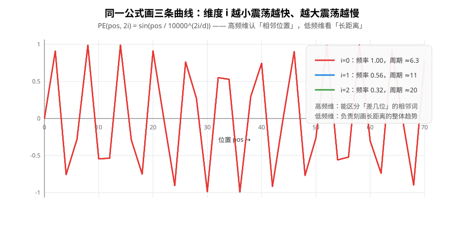
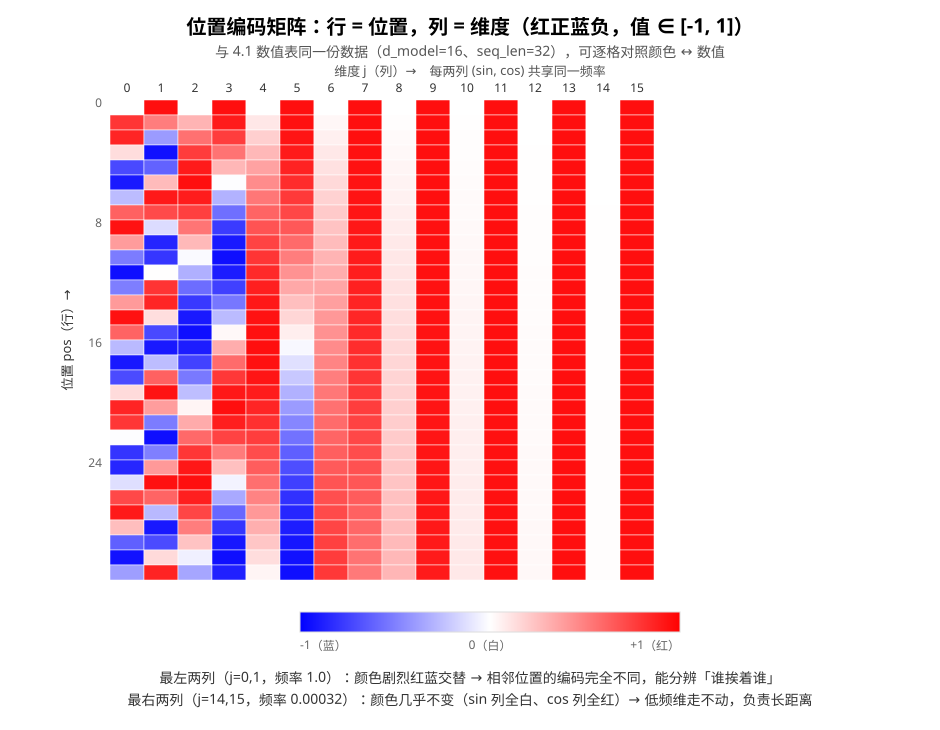

# 正弦位置编码（Sinusoidal Positional Encoding）原理

> 对应代码：`include/mini_mlmath/positional_encoding.h`（骨架期，核心填充待你实现）
> 配套测试：`tests/positional_encoding_test.cpp`
> 前置阅读：[Softmax](softmax.md)（注意力的邻居组件）、[自动求导](autograd.md)

Transformer 里有两个位置编码家族：**绝对位置编码**（本文讲的正弦版就是）和**相对位置编码**（RoPE 等）。本文只讲正弦版——它是《Attention Is All You Need》原文用的、也是理解所有后续变体的起点。先回答一个更根本的问题：**为什么非要有它。**

## 1. 为什么需要位置编码：注意力是「集合运算」

看注意力的核心算式：

```
Attention(Q, K, V) = softmax(Q · Kᵀ / √d) · V
```

假设把输入序列 `{x_1, ..., x_n}` 任意打乱顺序再喂进去。Q、K、V 都是**逐行**由 x 线性变换出来的，打乱顺序只会让 Q/K/V 的行跟着一起打乱——但 `Q·Kᵀ` 里的每一对 (i, j) 分数**还是原来的值**（只是排列变了）。也就是说：

> **注意力对「顺序」是天然的盲区**——它是集合运算，不是序列运算。无论句子是「猫追狗」还是「狗追猫」，注意力算出的每一对词的关系分数一模一样。

语言里顺序就是一切（「猫追狗」≠「狗追猫」），所以必须**显式地**把位置信息注入输入。做法：给每个位置生成一个「位置向量」，加到对应 token 的 embedding 上，让注意力能「看到」谁前谁后。

## 2. 公式：sin 和 cos 的双胞胎

```
PE(pos, 2i)   = sin(pos / 10000^(2i/d_model))    偶数维
PE(pos, 2i+1) = cos(pos / 10000^(2i/d_model))    奇数维
```

- `pos`：位置（0, 1, 2, …, seq_len-1）
- `i`：维度下标（0, 1, …, d_model-1）
- 输出一张 `seq_len × d_model` 的矩阵，第 pos 行就是位置 pos 的编码向量

怎么读这个公式：**把 d_model 维劈成 d_model/2 对 (sin, cos)，每一对共享同一个「角频率」`1/10000^(2i/d)`**。比如 d_model=4：

| 维度 | 0 | 1 | 2 | 3 |
|---|---|---|---|---|
| 函数 | sin | cos | sin | cos |
| 角频率 | 1 | 1 | 1/100 | 1/100 |

第 0、1 维是高频（每约 6 个位置走一个周期），第 2、3 维是低频（角频率 1/100 ≈ 0.01，约 314 个位置才走半个周期）。`10000` 这个底数纯粹是「经验值」——它决定了频率从高到低的跨度。

## 3. 多尺度频率：高频认「相邻」，低频看「远方」

把 `sin(pos / 10000^(2i/d))` 对几个不同的 i 画出来（d_model=8 的真实角频率），一眼就能看出「多尺度」的意思：



- **高频维（i 小）**：周期短，位置挪动一格数值就大变样 → 负责**区分相邻位置**。句子开头的词和紧随其后的词，编码值完全不同。
- **低频维（i 大）**：周期长，几十个位置内数值几乎不变 → 负责**刻画长距离**。隔得再远的词，低频维仍保持某种「连续性」。

这个设计和**多尺度信号处理**的思想一脉相承：高频给精度、低频给全局，各司其职。也正因为有高频维，attention 才能分辨「第 3 个词和第 4 个词」——如果全用低频，相邻位置的编码几乎一样，注意力会傻傻分不清。

## 4. PE 矩阵长什么样

把 32 个位置 × 16 个维度画成热力图（红=正值、蓝=负值、白=0）——和下面 4.1 的数值表**同一份数据**，可以逐格对照颜色 ↔ 数值：



- **列**（固定维度）：每一列是一条独立的 sin 或 cos 序列，从上到下扫过，颜色红蓝交替的**频率**逐列降低；
- **行**（固定位置）：`pos=0` 那行恒为 `[0, 1, 0, 1, 0, 1, ...]`（sin0=0、cos0=1）——这是测试里一眼就能核对的锚点；
- **相邻两列**（sin, cos 对）共享同一频率，相位差 90°，保证「任何一个维度对」能组合出完整的方向信息。

### 4.1 完整数值表：用本库函数生成（d_model=16、seq_len=32）

下面这张表是直接调 `sinusoidal_positional_encoding<double>(32, 16)` 算出来的完整矩阵（2 位小数）。读它的几个锚点：

- **第 0 行**恒为 `[0, 1, 0, 1, ...]`：sin0=0、cos0=1，每个维度对都从「0 相位」起步；
- **列 0/1（频率 1.0）**：每约 6 个位置走一个周期，数值在 -1..1 之间来回震荡，相邻位置差别很大；
- **列 2/3（频率 ≈0.32）**：周期约 20，震荡比列 0/1 慢约 3 倍；
- **列 14/15（频率 ≈0.00032）**：32 个位置里角度总共只走 0.01 弧度，sin 列从 0 缓慢爬到 0.0098、cos 列恒等于 1——低频维的极端形态，确实是「看长距离」的。

| pos \ 维度 | 0 | 1 | 2 | 3 | 4 | 5 | 6 | 7 | 8 | 9 | 10 | 11 | 12 | 13 | 14 | 15 |
|---|---|---|---|---|---|---|---|---|---|---|---|---|---|---|---|---|
|  0 |  0.00 |  1.00 |  0.00 |  1.00 |  0.00 |  1.00 |  0.00 |  1.00 |  0.00 |  1.00 |  0.00 |  1.00 |  0.00 |  1.00 |  0.00 |  1.00 |
|  1 |  0.84 |  0.54 |  0.31 |  0.95 |  0.10 |  1.00 |  0.03 |  1.00 |  0.01 |  1.00 |  0.00 |  1.00 |  0.00 |  1.00 |  0.00 |  1.00 |
|  2 |  0.91 | -0.42 |  0.59 |  0.81 |  0.20 |  0.98 |  0.06 |  1.00 |  0.02 |  1.00 |  0.01 |  1.00 |  0.00 |  1.00 |  0.00 |  1.00 |
|  3 |  0.14 | -0.99 |  0.81 |  0.58 |  0.30 |  0.96 |  0.09 |  1.00 |  0.03 |  1.00 |  0.01 |  1.00 |  0.00 |  1.00 |  0.00 |  1.00 |
|  4 | -0.76 | -0.65 |  0.95 |  0.30 |  0.39 |  0.92 |  0.13 |  0.99 |  0.04 |  1.00 |  0.01 |  1.00 |  0.00 |  1.00 |  0.00 |  1.00 |
|  5 | -0.96 |  0.28 |  1.00 | -0.01 |  0.48 |  0.88 |  0.16 |  0.99 |  0.05 |  1.00 |  0.02 |  1.00 |  0.00 |  1.00 |  0.00 |  1.00 |
|  6 | -0.28 |  0.96 |  0.95 | -0.32 |  0.56 |  0.83 |  0.19 |  0.98 |  0.06 |  1.00 |  0.02 |  1.00 |  0.01 |  1.00 |  0.00 |  1.00 |
|  7 |  0.66 |  0.75 |  0.80 | -0.60 |  0.64 |  0.76 |  0.22 |  0.98 |  0.07 |  1.00 |  0.02 |  1.00 |  0.01 |  1.00 |  0.00 |  1.00 |
|  8 |  0.99 | -0.15 |  0.57 | -0.82 |  0.72 |  0.70 |  0.25 |  0.97 |  0.08 |  1.00 |  0.03 |  1.00 |  0.01 |  1.00 |  0.00 |  1.00 |
|  9 |  0.41 | -0.91 |  0.29 | -0.96 |  0.78 |  0.62 |  0.28 |  0.96 |  0.09 |  1.00 |  0.03 |  1.00 |  0.01 |  1.00 |  0.00 |  1.00 |
| 10 | -0.54 | -0.84 | -0.02 | -1.00 |  0.84 |  0.54 |  0.31 |  0.95 |  0.10 |  1.00 |  0.03 |  1.00 |  0.01 |  1.00 |  0.00 |  1.00 |
| 11 | -1.00 |  0.00 | -0.33 | -0.94 |  0.89 |  0.45 |  0.34 |  0.94 |  0.11 |  0.99 |  0.03 |  1.00 |  0.01 |  1.00 |  0.00 |  1.00 |
| 12 | -0.54 |  0.84 | -0.61 | -0.79 |  0.93 |  0.36 |  0.37 |  0.93 |  0.12 |  0.99 |  0.04 |  1.00 |  0.01 |  1.00 |  0.00 |  1.00 |
| 13 |  0.42 |  0.91 | -0.82 | -0.57 |  0.96 |  0.27 |  0.40 |  0.92 |  0.13 |  0.99 |  0.04 |  1.00 |  0.01 |  1.00 |  0.00 |  1.00 |
| 14 |  0.99 |  0.14 | -0.96 | -0.28 |  0.99 |  0.17 |  0.43 |  0.90 |  0.14 |  0.99 |  0.04 |  1.00 |  0.01 |  1.00 |  0.00 |  1.00 |
| 15 |  0.65 | -0.76 | -1.00 |  0.03 |  1.00 |  0.07 |  0.46 |  0.89 |  0.15 |  0.99 |  0.05 |  1.00 |  0.01 |  1.00 |  0.00 |  1.00 |
| 16 | -0.29 | -0.96 | -0.94 |  0.34 |  1.00 | -0.03 |  0.48 |  0.87 |  0.16 |  0.99 |  0.05 |  1.00 |  0.02 |  1.00 |  0.01 |  1.00 |
| 17 | -0.96 | -0.28 | -0.79 |  0.62 |  0.99 | -0.13 |  0.51 |  0.86 |  0.17 |  0.99 |  0.05 |  1.00 |  0.02 |  1.00 |  0.01 |  1.00 |
| 18 | -0.75 |  0.66 | -0.56 |  0.83 |  0.97 | -0.23 |  0.54 |  0.84 |  0.18 |  0.98 |  0.06 |  1.00 |  0.02 |  1.00 |  0.01 |  1.00 |
| 19 |  0.15 |  0.99 | -0.27 |  0.96 |  0.95 | -0.32 |  0.57 |  0.82 |  0.19 |  0.98 |  0.06 |  1.00 |  0.02 |  1.00 |  0.01 |  1.00 |
| 20 |  0.91 |  0.41 |  0.04 |  1.00 |  0.91 | -0.42 |  0.59 |  0.81 |  0.20 |  0.98 |  0.06 |  1.00 |  0.02 |  1.00 |  0.01 |  1.00 |
| 21 |  0.84 | -0.55 |  0.35 |  0.94 |  0.86 | -0.50 |  0.62 |  0.79 |  0.21 |  0.98 |  0.07 |  1.00 |  0.02 |  1.00 |  0.01 |  1.00 |
| 22 | -0.01 | -1.00 |  0.62 |  0.78 |  0.81 | -0.59 |  0.64 |  0.77 |  0.22 |  0.98 |  0.07 |  1.00 |  0.02 |  1.00 |  0.01 |  1.00 |
| 23 | -0.85 | -0.53 |  0.84 |  0.55 |  0.75 | -0.67 |  0.66 |  0.75 |  0.23 |  0.97 |  0.07 |  1.00 |  0.02 |  1.00 |  0.01 |  1.00 |
| 24 | -0.91 |  0.42 |  0.97 |  0.26 |  0.68 | -0.74 |  0.69 |  0.73 |  0.24 |  0.97 |  0.08 |  1.00 |  0.02 |  1.00 |  0.01 |  1.00 |
| 25 | -0.13 |  0.99 |  1.00 | -0.05 |  0.60 | -0.80 |  0.71 |  0.70 |  0.25 |  0.97 |  0.08 |  1.00 |  0.02 |  1.00 |  0.01 |  1.00 |
| 26 |  0.76 |  0.65 |  0.93 | -0.36 |  0.52 | -0.86 |  0.73 |  0.68 |  0.26 |  0.97 |  0.08 |  1.00 |  0.03 |  1.00 |  0.01 |  1.00 |
| 27 |  0.96 | -0.29 |  0.77 | -0.63 |  0.43 | -0.90 |  0.75 |  0.66 |  0.27 |  0.96 |  0.09 |  1.00 |  0.03 |  1.00 |  0.01 |  1.00 |
| 28 |  0.27 | -0.96 |  0.54 | -0.84 |  0.33 | -0.94 |  0.77 |  0.63 |  0.28 |  0.96 |  0.09 |  1.00 |  0.03 |  1.00 |  0.01 |  1.00 |
| 29 | -0.66 | -0.75 |  0.25 | -0.97 |  0.24 | -0.97 |  0.79 |  0.61 |  0.29 |  0.96 |  0.09 |  1.00 |  0.03 |  1.00 |  0.01 |  1.00 |
| 30 | -0.99 |  0.15 | -0.06 | -1.00 |  0.14 | -0.99 |  0.81 |  0.58 |  0.30 |  0.96 |  0.09 |  1.00 |  0.03 |  1.00 |  0.01 |  1.00 |
| 31 | -0.40 |  0.91 | -0.37 | -0.93 |  0.04 | -1.00 |  0.83 |  0.56 |  0.31 |  0.95 |  0.10 |  1.00 |  0.03 |  1.00 |  0.01 |  1.00 |
## 5. 为什么偏偏是 sin/cos：相对位置可以「算出来」

这是正弦版最精巧的地方，也是选它而不是随机数的核心理由：**利用三角恒等式，位置 pos+k 的编码可以表示成位置 pos 编码的线性变换**：

```
sin(a+b) = sin(a)·cos(b) + cos(a)·sin(b)
cos(a+b) = cos(a)·cos(b) − sin(a)·sin(b)
```

即 `PE(pos+k)` 能写成 `PE(pos)` 与一个只依赖 k 的矩阵相乘。这意味着：

> 模型不需要记住「第 5 位和第 12 位是什么」，只要学会「距离 k 的线性变换」，就能把任意相对位置关系泛化到它没见过的位置上去。

这对泛化很重要——训练时见过的最长句子是 512 个词，推理时来了 600 个词的句子，位置编码依然能给出合理值（因为公式对任意 pos 都定义好了）。

## 6. 怎么用：加到 embedding 上

位置编码是**无参数常数**（不参与反向传播，不属于要学的权重）。在 transformer 里：

```
embedded = token_embedding(X)              # seq_len × d_model，查表
embedded = embedded + PE(seq_len, d_model) # 逐元素相加，注入位置
然后 embedded 作为 Q/K/V 的来源进入注意力
```

加法而不是拼接，是为了不改变维度；常数而不是可学习，是因为「相对位置线性可算」这个性质已经是白送的。对应代码（骨架期）：

```cpp
#include <mini_mlmath/positional_encoding.h>
auto pe = sinusoidal_positional_encoding<float>(seq_len, d_model);
// embedded(i, j) += pe(i, j);
```

## 7. 局限与变体

- **长度外推有限**：`10000` 底数是定死的，训练短、推理长时高频维仍是好的，但整体效果仍比专门的外推方案差。
- **可学习位置编码（learned PE）**：BERT / GPT-2 用的是「学出来的位置向量表」，效果和正弦版差不多，但长度固定、不能外推。实现上就是多一个参数矩阵（你的 `autograd.h` 能训它）。
- **旋转位置编码（RoPE）**：LLaMA / GPT 的现代默认。它把「位置 k」直接旋进 Q/K 向量里，让内积天然编码相对位置，外推能力更强。它的核心还是 sin/cos——先吃透本文的正弦版，再看 RoPE 会顺畅很多。
- **相对位置编码**：不是把位置加到 embedding，而是在 attention 分数里直接加「距离偏置」（Transformer-XL 的方案），和 RoPE 殊途同归。

## 8. 延伸阅读

- [Softmax](softmax.md)：`softmax(Q·Kᵀ/√d)` 是注意力另一半，两者拼起来就是 attention
- [自动求导](autograd.md)：位置编码是常数不进反向图，但可学习位置编码就要靠它了
- 下一步：[KNN](knn.md) 的距离感 vs 注意力的「软检索」——注意力本质是「可微的最近邻检索」，很有意思的对照
