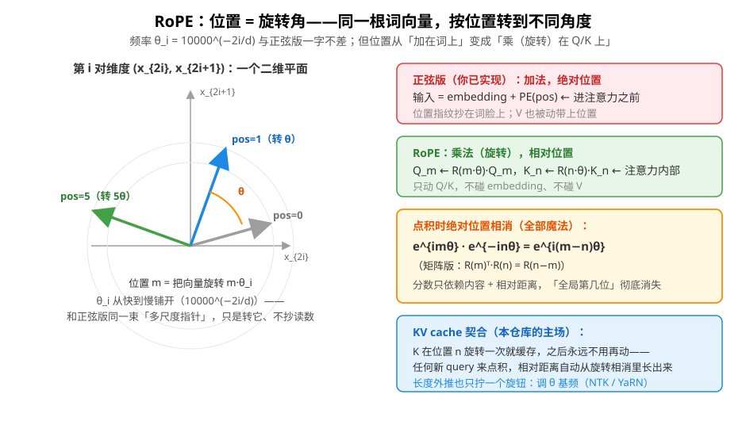

# RoPE 旋转位置编码（Rotary Position Embedding）原理

> 对应代码：`include/mini_mlmath/rope.h`（骨架期，核心旋转待你实现）
> 配套测试：`tests/rope_test.cpp`
> 前置阅读：[正弦位置编码](positional_encoding.md)（本文从它出发，频率公式完全复用）

正弦位置编码是 2017 年原版 Transformer 的方案。此后位置编码演化了三代：**可学习绝对编码**（BERT/GPT-2，直接学一张位置表）→ **相对位置编码**（Transformer-XL/T5，在注意力分数里加距离偏置）→ **旋转位置编码 RoPE**（2021，Su et al.《RoFormer》）。今天 LLaMA 全系、Qwen、DeepSeek、Mistral、Gemma 几乎清一色 RoPE。

本文回答三个问题：RoPE 长什么样？它和正弦版是什么血缘？为什么现代 LLM 都选它？

## 1. 先说结论：从「加」到「乘」

你已实现的正弦版把位置**加**在词上（进注意力**之前**）：

```
输入 = token_embedding + PE(pos)          ← 绝对位置，一次注入
```

RoPE 把位置**乘**在 Q/K 上（注意力**内部**）：

```
Q_m ← R(m·θ) · Q_m                        ← 把位置 m 的 query 旋转 m·θ
K_n ← R(n·θ) · K_n                        ← 把位置 n 的 key 旋转 n·θ
score(m,n) = Q_m · K_n ∝ q · R((n−m)·θ) · k   ← 点积里只剩相对位置！
```

注意「旋转」这个词是字面意义：把向量按角度转过去，不是比喻。

## 2. 直觉：位置 = 旋转角

RoPE 的设计目标是先写成一个数学性质，再反推实现：

> **要求**：注意力分数只依赖「内容 q, k」和「相对距离 m−n」，与绝对位置无关。
> **形式化**：⟨f(q, m), f(k, n)⟩ = g(q, k, m−n)

怎么造出满足这个性质的 f？作者的答案来自一个古老的数学工具——**二维旋转**：

1. 把 d 维向量看成 **d/2 个二维平面**：每对相邻维度 `(x_{2i}, x_{2i+1})` 是第 i 个平面上的一个点（等价于复数 `x_{2i} + i·x_{2i+1}`）；
2. 「位置 m」= 把第 i 个平面**旋转** `m·θ_i` 角度。

于是一个词向量在每个位置的样子，就是它自己被转到不同角度——**位置就是角度**。



## 3. 为什么绝对位置会消掉：一行复数看懂

把第 i 对维度记成复数。RoPE 就是乘上单位复数 `e^{i·m·θ}`（乘单位复数 = 旋转）。Q 在位置 m、K 在位置 n，点积（复数版：共轭相乘取实部）：

```
(q · e^{imθ}) · conj(k · e^{inθ}) = q·conj(k) · e^{imθ} · e^{−inθ}
                                   = q·conj(k) · e^{i(m−n)θ}
                                              ↑
                              指数相消：m 和 n 单独消失了，只剩 (m−n)
```

不喜欢复数？同一件事的矩阵版是旋转矩阵的**正交性**：

```
R(m)ᵀ · R(n) = R(n − m)        （先转 m 再转 n 的逆 = 净转 n−m）
⟨R(m)q, R(n)k⟩ = qᵀ·R(m)ᵀ·R(n)·k = qᵀ·R(n−m)·k
```

两种语言说的是同一件事：**绝对位置在 Q·Kᵀ 里天然抵消，只留下相对距离**。这就是 RoPE 名字里 "Rotary" 的含义，也是它满足 §2 那条数学要求的全部机制。

## 4. 完整公式（你会发现频率很眼熟）

对位置 m 的向量 x，第 i 对维度 `(2i, 2i+1)` 旋转 `m·θ_i`：

```
x'_{2i}   = x_{2i}·cos(m·θ_i) − x_{2i+1}·sin(m·θ_i)
x'_{2i+1} = x_{2i}·sin(m·θ_i) + x_{2i+1}·cos(m·θ_i)
```

就是二维旋转矩阵作用在列向量 `(x_{2i}, x_{2i+1})` 上：

```
R(m·θ_i) = [ cos(m·θ_i)  −sin(m·θ_i) ]
           [ sin(m·θ_i)   cos(m·θ_i) ]
```

整张旋转矩阵是 d/2 个 2×2 块的**分块对角**——每对维度各自转各自的角。而频率：

```
θ_i = 10000^(−2i/d_model)
```

**和正弦位置编码一字不差**。这不是巧合，是血缘：同一束「从快到慢的多尺度指针」，正弦版把指针读数**抄在词的脸上**（加法），RoPE 把词**按指针角度转过去**（乘法）。你在正弦版里建立的全部频率直觉——高频对区分相邻、低频对看长距离、10000 钉死频率范围——原封不动平移过来。

## 5. 动手实现（骨架 API）

```cpp
#include <mini_mlmath/rope.h>

// Q: n×d（每行一个位置的 query），行号即位置
auto q2 = rope_rotate(Q);                  // 第 m 行自动按 m·θ_i 旋转
auto k2 = rope_rotate(K);
scores = q2 * k2.transposed() / sqrt(d);   // 点积里只剩相对位置
// 注意：V 不旋转！RoPE 只动 Q/K
```

实现只有 15 行（骨架里的 TODO 有逐步提示）：预计算 `θ_i`（注意 `T(2*i)/T(d)` 的浮点除法坑，教训见正弦版），然后双循环逐行逐对套旋转公式。测试里埋了三个「性质验证」，其中**相对位置性质**是 RoPE 的灵魂：

```
⟨R(2)q, R(5)k⟩ == ⟨q, R(3)k⟩      （5−2 = 3）
```

你的实现只要这条过了，数学上就是对的。

## 6. 为什么现代 LLM 都选它

| | 正弦绝对版（你实现的） | RoPE |
|---|---|---|
| 位置观 | 绝对 pos | 相对 m−n（更贴语言本质）|
| 作用点 | 进注意力前，加在 embedding 上 | 注意力内部，只动 Q/K |
| 污染 | embedding 和 V 都被加了位置 | **不碰 embedding、不碰 V** |
| 频率 | `10000^(−2i/d)` | **一模一样** |
| KV cache | 每个 query 都要重加 PE | **K 转一次永久缓存**（见下）|
| 长度外推 | 弱 | 强：调 θ 基频即可（见下）|

**KV cache 契合（对本仓库最有意义的一条）**：K 在位置 n 只需旋转一次就存进 KV cache，之后**永远不用再动**——任何新来的 query（位置 m 很大）和它点积，相对距离 m−n 自动从旋转相消里长出来。绝对编码做不到：每个新位置都要重新构造 `PE(pos)` 再加。仓库叫 kvcache，RoPE 就是为它而生的位置编码。

**长度外推**：θ 的基频 10000 是唯一可调的旋钮。上下文要变长时，把基频调大（相当于把指针整体变慢、周期变长）就能让没见过的位置仍有合理编码——NTK-aware scaling、YaRN、Llama 3 的 rope scaling 全是围绕这一个数做文章。

## 7. 不是只有 RoPE：位置编码家族风向

- **正弦绝对版**（2017，原版 Transformer）：本文前作，教学黄金起点；
- **可学习绝对版**（BERT / GPT-2）：直接学一张 `max_len × d` 的位置表，效果和正弦版差不多，但长度锁死；
- **T5 相对偏置**：在注意力分数上加「距离 → 学出偏置」的查表；
- **ALiBi**（BLOOM / MPT 用）：注意力分数减 `slope·|m−n|`，越远越冷，简单到极致；
- **RoPE**（本文）：乘法旋转派，当前绝对主流；
- **RoPE 变体**：xPos（带衰减）、partial rotary（只转一半维度，GPT-NeoX）。

挑 RoPE 深入是对的——它同时是「主流中的主流」和「数学上最优雅的一个」。

## 8. 延伸阅读

- [正弦位置编码](positional_encoding.md)：频率、多尺度时钟直觉——RoPE 的直系前作
- [Softmax](softmax.md)：注意力公式的另一半
- [FlashAttention](flash_attention.md)：注意力怎么算得快（RoPE 管位置，Flash 管算子，可叠加）
- 论文：*RoFormer: Enhanced Transformer with Rotary Position Embedding*（Su et al., 2021）
