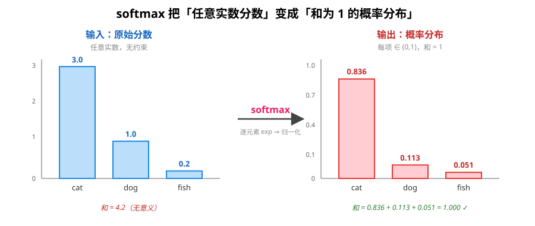
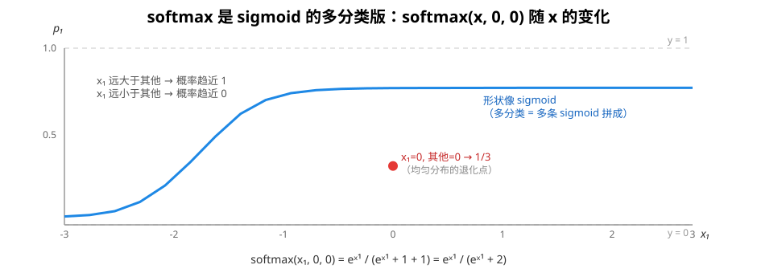
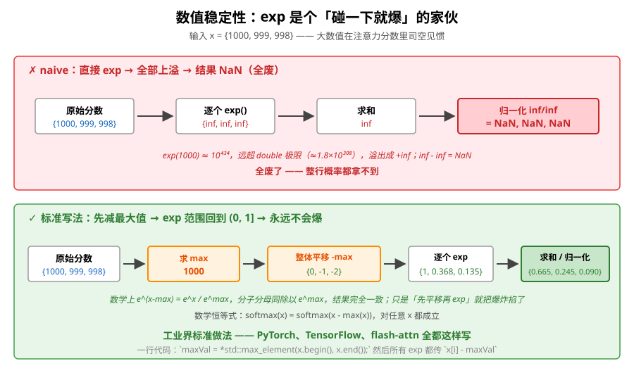
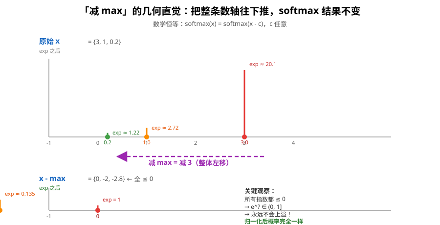
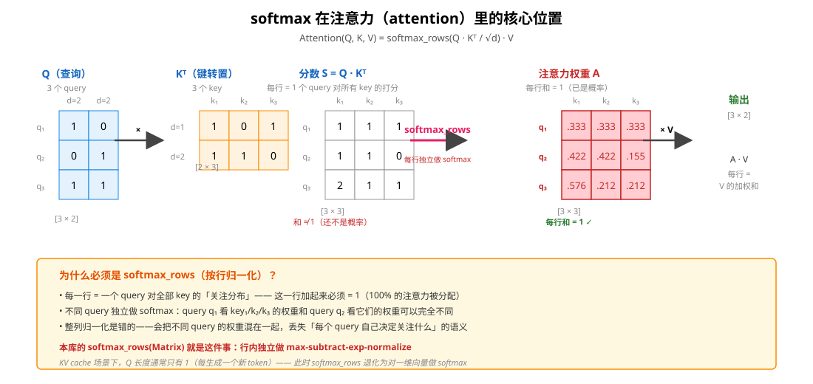
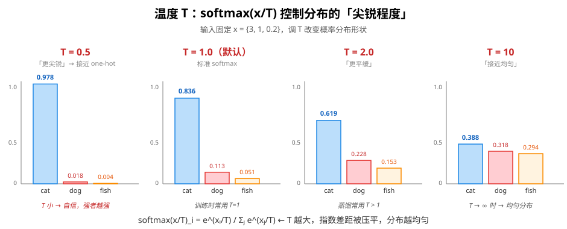

# Softmax：把分数变成概率分布

> 对应代码：`include/mini_mlmath/softmax.h`
> 前置阅读：[激活函数](activation.md)（sigmoid 是 softmax 的二分类特化）

softmax 是注意力机制、Transformer、几乎所有分类网络的「最后一公里」——把任意实数分数压成一个**和为 1 的概率分布**。本库给 KV cache 教学链提供数值稳定的实现（`softmax` 一维版 + `softmax_rows` 按行矩阵版）。

## 1. 定义：什么是 softmax

给定长度为 `n` 的实数向量 `x`，softmax 把每个元素 `xᵢ` 映射成「它在整体中的占比概率」：

```
softmax(x)ᵢ = exp(xᵢ) / Σⱼ exp(xⱼ)      i = 1, 2, ..., n
```

直觉：**先逐个求 exp（拉开差距），再除以总和（归一化）**。exp 这一步把任意实数压到正数，归一化让所有值加起来恰好是 1。



观察：左侧三个原始分数 `{3, 1, 0.2}` 怎么加都不是 1，右侧 softmax 之后三个值加起来恰好是 1.000。

## 2. softmax 是 sigmoid 的多分类推广

如果你看 [激活函数](activation.md) 那篇，会记得 sigmoid 是个二分类激活：`sigmoid(z) = 1/(1+e⁻ᶻ)`。softmax 是它**对多分类**的推广——把多个分数同时压成概率。

具体来说，二分类 sigmoid 等价于「二元 softmax」：

```
[sigmoid(z), 1 - sigmoid(z)] = softmax(z, 0)
```

而 softmax 单变量视角（固定其他元素为 0）画出来就是 sigmoid 的形状：



所以一个常见的工程结论：**二分类用 sigmoid + 1 个输出；多分类用 softmax + n 个输出**——不是两套机制，是 softmax 的两个特化。

## 3. 一个致命的实现陷阱：数值溢出

直觉上 softmax 公式很简单，直接照定义写：

```cpp
// naive（千万别这么写）
for (auto xi : x) {
    e[i] = std::exp(xi);  // ← 这里就爆了
    sum += e[i];
}
for (auto& ei : e) ei /= sum;
```

问题：当 `xᵢ` 比较大（比如注意力分数动辄几十上百），`exp(xᵢ)` 直接溢出成 `+inf`：

```
exp(1000) ≈ 10⁴³⁴      ← 远超 double 极限 ≈ 1.8 × 10³⁰⁸
exp(1000) 变成 +inf
inf / inf = NaN         ← 整行概率全废
```

更糟糕的是「整行等大」的情况：`{1000, 999, 998}`，三个 `exp` 全溢出，三个 `inf` 加起来还是 `inf`，`inf/inf` 还是 `NaN`。**不是偶尔出错，是大数据集上必出错**——注意力分数想多大都行。

## 4. 救命符：先减最大值（数学恒等）

`exp` 对「整体平移」是不变的——这是 softmax 数值稳定性的全部立足点：

```
softmax(x)ᵢ = exp(xᵢ) / Σⱼ exp(xⱼ)
            = exp(xᵢ - c) / Σⱼ exp(xⱼ - c)     ← c 任意
```

证明：分子分母同乘 `exp(-c)`，c 消掉。所以**任意 c 都行**——我们选 `c = max(x)`，让最大那个变成 `exp(0) = 1`，其他都 ≤ 0，`exp(≤ 0) ∈ (0, 1]`。**指数函数从「碰一下就爆」变成「永远在 (0, 1]」**。





实现就一行成本：

```cpp
// softmax.h 的标准写法（详见第 8 节代码对应）
const T maxVal = *std::max_element(x.begin(), x.end());   // 1) 求 max
for (std::size_t i = 0; i < x.size(); ++i) {
    e[i] = std::exp(x[i] - maxVal);                       // 2) 减 max 再 exp
    sum += e[i];
}
```

这一步**不是优化，是正确性**。PyTorch / TensorFlow / flash-attn 全部这么写。

### 为什么「整体平移不变」这么关键？

因为 softmax 的本质是「相对比较」——它只在乎 `xᵢ` 之间的**差值**，不在乎绝对值。减 max 改变的是绝对值，差值保持不变，结果当然不变。

直觉类比：考试卷满分 100 你得了 90，和满分 1000 你得了 900，**成绩排名是一样的**——softmax 关心排名，不关心具体分数。减 max 就是把"满分"归零，让所有分数变成"距离满分的差距"，差距本身不变。

## 5. softmax_rows：注意力里的标准用法

注意力机制的核心公式（KV cache 场景的关键一步）：

```
Attention(Q, K, V) = softmax_rows(Q · Kᵀ / √d) · V
```



为什么是「按行」？**每一行 = 一个 query 对全部 key 的关注分布**，这一行的总和必须是 1（100% 的注意力分配到所有 key 上）。不同 query 独立做 softmax，不能串行。

```cpp
// softmax_rows 的简化版本
template <typename T>
Matrix<T> softmax_rows(const Matrix<T>& x) {
    Matrix<T> r(x.rows(), x.cols());
    for (std::size_t i = 0; i < x.rows(); ++i) {
        const T* row = x.data() + i * x.cols();
        T* out = r.data() + i * x.cols();

        // 1) 行内求 max（注意：是行内 max，不是整矩阵 max）
        T maxVal = *std::max_element(row, row + x.cols());

        // 2) 减 max 再 exp + 累加
        T sum = T(0);
        for (std::size_t j = 0; j < x.cols(); ++j) {
            out[j] = std::exp(row[j] - maxVal);
            sum += out[j];
        }

        // 3) 归一化
        for (std::size_t j = 0; j < x.cols(); ++j) out[j] /= sum;
    }
    return r;
}
```

**整列归一化是错的**——会把不同 query 的权重混在一起，丢失「每个 query 自己决定关注什么」的语义。softmax_rows 就是这件事：每行独立 `max → 减 max → exp → 归一化`。

### KV cache 场景的特殊简化

KV cache 的解码阶段，新生成的 token 只有一个，Q 长度 = 1。此时：

```cpp
Matrix<T> scores = Q * K.transposed();  // [1 × seq_len]
Vector<T> weights = softmax(scores.row(0));  // 退化为对行向量做 softmax
```

所以 softmax 的「一维版」和「按行版」在 KV cache 里其实是同一个东西的两个视角——库同时提供两个 API 是因为其他场景（训练时整段 attention）Q 长度可能 > 1。

## 6. 温度 T：调节分布的「尖锐程度」

softmax 还有个常被忽略的参数——温度 `T`：

```
softmax(x/T)ᵢ = exp(xᵢ/T) / Σⱼ exp(xⱼ/T)
```

T 越大，指数之间的差距被压平，分布越均匀；T 越小，差距被放大，分布越尖锐（趋近 one-hot）：



| T 趋势 | 效果 | 典型场景 |
|---|---|---|
| T → 0 | 趋近 argmax / one-hot | 推理时想要确定答案 |
| T = 1 | 标准 softmax | 训练、分类 |
| T → ∞ | 趋近均匀分布 | 知识蒸馏（让小模型学"暗知识"） |
| T > 1 | 分布更平缓 | 蒸馏 / 生成时增加多样性 |
| T < 1 | 分布更尖锐 | 推理时增加置信度 |

**直觉**：`x/T` 相当于把分数的"刻度尺"放大/缩小了 T 倍。T=0.5 时分数翻倍，强者优势加倍；T=2 时分数减半，所有人差距缩小。

LLM 推理时常见的「temperature sampling」参数就是这个 T——你设的 `temperature=0.7` 就是让生成的多样性介于"完全确定"和"完全随机"之间。

## 7. softmax 一定能产生合法概率吗？

是的——只要输入长度 ≥ 1（不是空向量），输出**严格落在 (0, 1) 开区间**：

- **非负**：`exp(...) > 0`，所以每项 `eᵢ / sum > 0`，不会出现 0
- **和 = 1**：归一化步强制保证
- **严格 < 1**：因为至少有两项共享总和（除非向量长度 = 1），所以每项都 < 1

**副作用**：输出永远不会正好是 0 或 1。所以后面算交叉熵 `-log(softmax(x))` 时 `-log(0)` 永远不会发生——`softmax` 是**天然 log-safe** 的。

这和 `sigmoid` 的「分段 trick 避免溢出」是同一类防御性编程：**指数函数天生会爆，输出天生想归零/归一，实现里必须主动防**。

## 8. 在线 softmax：flash-attention 的核心（预告）

本库 `softmax.h` 末尾留了个 hint：在线 softmax（online softmax）。它的动机是：

> 上面那种「先求 max，再 exp，再求和」需要**两遍扫描**输入——第一遍找 max，第二遍算 exp 和累加。在 flash-attention 的流式分块 attention 里，内存放不下整个 attention 矩阵，必须**一遍扫完**就给出结果。

在线 softmax 的核心 idea 是**维护两个 running 统计量**：

```
m_new = max(m_old, x_new)        // 当前见过的最大值
d_new = d_old * exp(m_old - m_new) + exp(x_new - m_new)   // 当前见过的 exp 总和（修正后）
```

新来一块数据时，用旧 max 修正旧的 sum（`exp(m_old - m_new)` 倍），再加上新块的贡献。这样**只需要一遍**就能得到最终 softmax 不需要的所有统计量。flash-attn 的核心收益从这里来。

这超出了本库当前范围，等我们做 flash-attention 教学版时再展开。

## 9. 和本库代码的对应

```cpp
#include <mini_mlmath/softmax.h>

// 1) 一维向量版 —— 普通 attention 分数、分类 logits
std::vector<double> scores = {3.0, 1.0, 0.2};
std::vector<double> probs = softmax(scores);   // {0.836, 0.113, 0.051}

// 2) 矩阵按行版 —— 整段 attention score 矩阵（多个 query）
Matrix<double> S(3, 4);                         // 3 个 query × 4 个 key
// ... 填上 Q*Kᵀ 的值 ...
Matrix<double> A = softmax_rows(S);             // 每行是 1 个 query 的关注分布
// A.row_sum(i) == 1 for all i

// 3) 数值稳定已经在库内部处理：库版本第一行就是
//    const T maxVal = *std::max_element(x.begin(), x.end());
//    所以调用者不需要操心
```

**为什么 softmax 是「自由函数」而不是 class？** softmax 是**无状态**的纯函数运算——输入一组数、输出概率分布，没有任何内部状态。为无状态运算硬造一个类只会多一层没用的包装，这和本库「无表达式模板、一眼看懂在算什么」的定位一致。等需要缓存中间统计量（在线 softmax）时才值得变成类。

## 10. 常见错误和对应修复

| 错误 | 后果 | 正确做法 |
|---|---|---|
| 直接 `exp(x)` 不减 max | 大数值时整行 NaN | 先 `maxVal = max(x)`，所有 exp 传 `x[i] - maxVal` |
| 输出再用 `log` | 可能 `log(0) = -inf` | softmax 输出永远在 (0, 1)，log 天然安全（但建议 `log_softmax` 一起算） |
| 整列归一化 | 跨 query 混淆权重 | 用 `softmax_rows`，行内独立归一化 |
| softmax 用来做二分类 | 浪费一半概率空间 | 二分类用 sigmoid，softmax 留给 ≥3 类 |
| 自己写 `log + exp` 复合 | 重新引入不稳定 | 直接用库版 / PyTorch 原生 `log_softmax` |

## 11. 延伸阅读

- [激活函数](activation.md) —— softmax 是 sigmoid 的多分类推广，二者数值稳定性思路一致
- 在线 softmax（flash-attention 核心）：见 `softmax.h` 末尾注释，等本库出 flash-attn 教程时展开
- 交叉熵损失：`-Σ yᵢ log(softmax(x)ᵢ)`，与 softmax 天然配合
- KV cache 里的 attention 流程：把 Q、K 矩阵乘出来 → softmax_rows → 乘 V，是 KV cache 教学链的下一节
